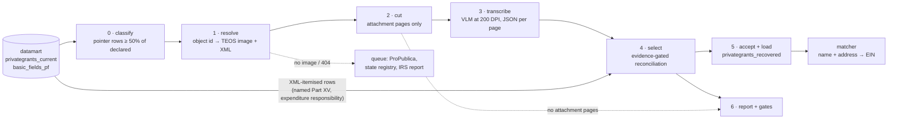

# Placeholder Grant Recovery — the pipeline, end to end

*Sketch, September 21, 2026. Builds on
[placeholder_grant_recovery.md](placeholder_grant_recovery.md), which holds
the evidence for every choice below. Stages 1–4 are wired up for the
100-filing sample (`placeholder_recovery.py`: `sample`, `stage`,
`transcribe`, `report`); stage 0 exists as SQL; stages 5 and 6 are not
built.*

## The shape

Each stage writes one table or one directory of files, keyed on the IRS object id,
and never modifies an upstream one. Anything can be rerun from its input.

## Stages

### 0 · Classify — which filings need their PDF

**Input:** `privategrants_current` (2020+) joined to the declared total in
`basic_fields_pf` (Part I line 25, `arecgpdcprps`).
**Output:** `pf_placeholder_filings` — one row per filer-year: object id,
class, paid target, pointer text, classifier version.

The rule, measured in
[placeholder_classifier_assessment.sql](../data/exploratory/placeholder_classifier_assessment.sql):
a filing is **fetch** when pointer-named rows (`is_pointer()`, the broadened
pattern) hold at least half its declared total. Everything else gets a
class that says why not — *mixed*, *withheld* ("available upon request":
no PDF will help), *various* (no pointer; untested), *pass-through* (one
named recipient carrying the whole year), *itemised*. Patient-assistance
EINs and status-`I` rows are excluded here, by EIN and flag, never by name.

Over 2020–2025 that is ~13,000 fetch filings and $64.6B, of which ~4,600
filings are patient assistance. The organisational remainder is the
population: roughly 8,500 filings, $25–30B.

### 1 · Resolve — the IRS's own copies

**Input:** object ids from stage 0.
**Output:** `pf_recovery_manifest` — image URL, generation date, whether
RETURN_ID pinned it, XML URL, status (`staged`, `no_teos_image`,
`pdf_unavailable:404`), filer state.

[`irs_source.py`](../givingtuesday_datamart/irs_source.py) as it stands.
Two additions: pull the XML too (it is the authoritative source of both
targets, `TotalGrantOrContriPdDurYrAmt` and `TotalGrantOrContriApprvFutAmt`,
and of the filer's state), and route the failures. TEOS lists no image
for ~9% of filings and 404s another ~6%, all of the 404s images generated
in 2022. Those go to a queue, not to OCR: ProPublica's API for the older
image program (it had 2 of the sample's 15), the state registry by hand
for the largest (NY is CAPTCHA-gated), and one batch report to the IRS.

### 2 · Cut — send only the attachments

**Input:** the staged PDF.
**Output:** in the manifest, the page the filer's attachments start on
and how many there are (`attachment_from`, `attachment_pages`).

Every TEOS image is the IRS's rendering of the XML followed by the
filer's attachments. The IRS renders at five fixed image widths (2246 px
form pages; 2259, 2440, 3062 and 3081 px supporting statements), cropped
to content; attachments are full 2550×3300 pages or whatever the scanner
produced. `pdfimages -list` reads the boundary without rendering
(`irs_source.attachment_start`), and only the pages after it are rendered
for the model. On the sample that is 1,782 of 4,746 pages (38%): half the
pages in bands A and B, 7% in C, 1% in D. Twenty-six of the 85 staged
filings have no attachment page at all and are *absent* by construction —
no model call, no false positive from the form's own money tables.

The cut removes one thing the OCR selector had been leaning on: the
IRS-rendered **expenditure-responsibility statement**. Two OCR
reconciliations (Cohen 2020, Anschutz 2022) were the attachment's list
*plus* that statement — Unstructured had lost the attachment's own page
carrying the $85M to Cohen Veterans Network, and the statement filled the
hole. Those rows are in the XML — GT's extract has them as
`990PF_EXPENDITURE_RESP`, and a few placeholder filers also name some
Part XV grants — so stage 4 takes the XML's itemised rows as exact tables
beside the transcribed pages, and the subset search decides whether they
belong in the sum. `sample` writes them for the 100 filings
(`placeholder_sample_xml_rows.csv`: 116 rows across 26 filings); in
production they come from `privategrants_current`. With the models reading
the attachment correctly, Cohen and Anschutz reconcile from the attachment
alone; Hall 2023 is the filing where the XML rows closed the gap.

### 3 · Transcribe

**Input:** the attachment pages, rendered at 200 DPI.
**Output:** one JSON file per page — its kind (paid list, future list,
expenditure responsibility, other), its heading, one row per recipient
line (name, address, status, purpose, amount) and the totals printed on
it — plus token usage, finish reason and attempt count.

[`vlm_transcription.py`](../givingtuesday_datamart/vlm_transcription.py)
through the Vercel AI Gateway. The prompt is versioned and every stored
page carries the version that produced it; results go to
`<model>-<version>` folders so a revision is scored against the last one.
v3 (from the sample) says what a heading is — the list title, not the
filer masthead Gemini put there or the recipient line Qwen did — keeps a
contact person inside their organisation's row, and asks for one row per
recipient however many printed lines it wraps onto.

Three retries, each for a failure the runs showed: a transport error
waits and asks again (on top of the SDK's own); output cut off at the
token limit is re-asked with twice the room; a page the model labelled a
grant list but returned no rows for, or stopped mid-row on, is asked
again **without JSON mode**, and the fullest parsed answer is kept. That
last one came from the sample: Qwen answered 401 dense list pages with an
empty list in five seconds each — 384 of Johnson & Johnson's 836, 7 of
First Horizon's 30 — twice each, under `response_format=json_object`;
the same pages read at 59–87 rows without it, five of five tried, and no
prompt wording changed that. Every page also gets a **page-level check**:
do its rows sum to a total printed on it? Matched pages need no further
look; a mismatch is a flag, not a verdict, since printed totals are often
cumulative.

Volumes after the cut, from the sample's attachment pages per filing
(30.7 in band A, 30.6 in B, 1.9 in C, 0.3 in D):

| band | filings | attachment pages |
|---|---|---|
| A | 22 | 584 (done) |
| B | 442 | ~13,500 |
| C | 2,299 | ~4,300 |
| D | 6,755 | ~2,000 |

About 20,000 pages for the whole population, eleven times the sample.
Uncut it would have been 2.6 times that; the earlier estimate of 45,000
counted the wide IRS statements as attachments. At the gateway's prices
that is about $36 with Qwen3-VL instruct and $74 with Gemini 3.5 Flash
Lite; Unstructured ($0.015 a page after 10,000 free) would have been
about $150.

### 4 · Select — the reconciliation gate

**Input:** the per-page JSON, the XML-itemised rows, the targets from
the XML, the page map.
**Output:** `pf_recovery_results` — per filing and per target (paid,
future): outcome, extracted sum, error, evidence (labelled / names),
whether a stated total matched, coverage, pages in original numbering,
selector version.

[`attachment_grants.py`](../givingtuesday_datamart/attachment_grants.py)
as rebuilt: a run needs reconciliation *and* a second class of evidence.
Three producers feed one selector: `candidate_tables` (Unstructured
elements, the baseline), `page_tables` (a model's page JSON — the heading
is the context exactly as an OCR heading was, and the page kind is a
second, independent label) and `xml_tables` (the itemised rows, exact,
one table per source); `extract_tables` reconciles whatever mix it is
given. A page whose heading says nothing, and which the model labels a
list, inherits the previous page's heading and kind — the models cannot
tell a paid continuation from a future one, and both called Kenan's
second future-payment page a paid list — unless that previous page closed
its list with a total equal to a declared amount, in which case the next
page opens a new statement. A page the model calls *other* never
inherits.
Paid and future reconcile separately. Failures are diagnosed — list
present, partial, absent — and *present* carries a coverage number, since
the largest failure class is a labelled list that OCR returned at 90–110%
of the target.

### 5 · Accept and load

**Output:** `privategrants_recovered` — one row per grant: filer, tax year,
object id, recipient name, address cells, amount, purpose, status; and
for lineage the PDF URL, original page number, OCR job id, selector
version, target reconciled against, and error. A view unions it with
`privategrants_current` for the matcher, tagged `match_source =
'ocr_recovery'`.

Two policies to set, in order:

1. **Reconciled** (≤ 0.5%): load. 29 of the 100 sample filings.
2. **Labelled, 90–110% covered**: load with coverage recorded, or re-OCR
   the failing pages first. 14 filings and $1.55B in the sample — a quarter
   of the money — and it is an OCR problem, not a selection problem. This
   decision waits on the ground-truth set (stage 6).

Future-payment lists (line 3b) are commitments, not payments. Capture
them; do not load them into a grants table.

### 6 · Report and gates

- **Ground truth:** 15 filings with rows counted from the PDF by hand.
  This is the only measurement of row-level precision the pipeline will
  have, and it sets the coverage policy.
- **Regression gate:** the old-versus-new harness over the 100-filing
  sample, run on every selector change. Two intermediate versions this
  session overcorrected to 27%; the harness is what caught them.
- **Canaries:** Siegel (reconciles to the dollar), Bezos 2022 (cash plus
  non-cash), Klarman (subtotals), Wells Fargo 2020 (blank-name total, OCR
  row loss), Hall (line 3a is list plus matching gifts plus scholarships).
- **The report** by band, plus the unreachable list with its routing.

## Do we need Unstructured? The bake-off

Fourteen attachment pages with known answers, through seventeen models on
the Vercel AI Gateway plus two OpenAI models, same prompt, JSON out. The
harness, reference and full table are in
[`exploratory/vlm_bakeoff/`](../givingtuesday_datamart/exploratory/vlm_bakeoff/).

| page set | truth |
|---|---|
| Siegel 2023, pages 31–39 | 110 rows, declared $26,907,603 to the dollar |
| Wells Fargo 2020, pages 100 and 233 | dense, rotated landscape; p233 is 20 rows to a printed $21,344,804.43 (verified by hand) |
| Klarman 2020, page 60 | program subtotals inline |
| Bezos 2022, pages 38 and 41 | non-cash: fair market value beside book value |

Scored on pages transcribed exactly, sums against the truths, and the share
of reference amounts found across all 14 pages. Prices are the gateway's
per-token rates on the day; Unstructured is $0.015 a page.

| model | Siegel pages exact | Siegel sum | WF p233 | amounts matched | $/page | vs Unstructured |
|---|---|---|---|---|---|---|
| Gemini 3.5 Flash Lite (200 DPI) | 9/9 | 100% | 20/20, exact | 89% | $0.0037 | 4× cheaper |
| Gemini 3.8 Flash | 9/9 | 100% | 20/20, exact | 94% | $0.0140 | parity |
| **Qwen3-VL instruct (200 DPI)** | 9/9 | 100% | 20/20, exact | 89% | $0.0018 | 8× cheaper |
| Qwen3-VL 235B | 9/9 | 100% | 20/20, +4.7% | 86% | $0.0016 | 9× cheaper |
| Ling 3.0 Flash VL (free tier) | 8/9 | 102% | 20/20, exact | 78% | $0 | free, slow |
| Llama 4 Maverick | 7/9 | 99% | 20/20, +1.2% | 73% | $0.0023 | 7× cheaper |
| gpt-5-mini | 8/9 | 88% | 16/20 | 46% | — | — |
| the rest (Gemma 4, Mistral Small, Nova 2 Lite, DeepSeek V4 vision, Haiku 4.5, Nemotron nano, GLM-4.5V, gpt-4.1) | 0–6/9 | 84–249% | — | 27–75% | | |

What it showed:

- **Yes, a vision model replaces Unstructured for attachment pages.**
  Qwen3-VL instruct and Gemini 3.5 Flash Lite, both at 200 DPI, reproduce
  the Siegel list to the dollar and the dense Wells Fargo page to the
  cent, at an eighth and a quarter of the price. They are identical on 11
  of the 14 pages; Qwen added no phantom row on the dense page and never
  truncated, Gemini handled the non-cash page better. Gemini 3.8 Flash is
  the most accurate overall, at Unstructured's price.
- **Resolution is not optional.** At 130 DPI Qwen misread two of twenty
  amounts on the Wells Fargo page (200 as 2,000; a leading 1 as 2). At
  200 DPI both went away, for 50% more input tokens.
- **Reasoning models refuse at random.** gpt-5-mini on the identical Siegel
  image returned 13 rows, then 0 rows labelled "other", then 13 again.
  Transcription wants a non-reasoning model, and a retry on empty output.
- **Some models invent amounts under confident names** — gpt-4.1 returned
  Siegel page 34 at $11.95M against $3.83M, Haiku 4.5 summed Siegel at
  249% of the truth. This is the failure the reconciliation gate exists
  for, and why the gate stays whatever transcribes the page.
- **The hard page is non-cash.** With fair market value beside book value
  every model mixed columns on some rows, and the long rows pushed two
  models past their JSON output limit. The fix is a column-specific
  instruction plus the page's own printed total: Qwen read "Total Non-Cash
  Contributions 88,203,692.86" correctly while getting rows wrong, so the
  page can flag itself.
- **The models transcribe printed totals and label the page.** That is
  most of the selector's heading heuristics done at the source, plus a
  page-level gate the OCR path never had.

Not measured here: name accuracy against ground truth (the reference is
Unstructured's rows). Behaviour on an 800-page filing and gateway
throughput were measured on the sample run below.

## The sample through both models

The whole 100-filing sample, every attachment page (1,782), through both
finalists at 200 DPI, scored by the same selector as the Unstructured
baseline. Per-filing detail is in `data/exploratory/placeholder_report_*.csv`
and the filing-by-filing differences in `placeholder_engine_differences.csv`
(`placeholder_recovery.py compare`).

The sample has now been read twice by each model — once under prompt v2,
once under v3 with the no-JSON retry — and all four reads are scored by
the current selector (the continuation-page rule included).

| band | Unstructured | Qwen v2 | Gemini v2 | Qwen v3 | Gemini v3 | any of the four |
|---|---|---|---|---|---|---|
| A (22) | 10 / $1,326M | 14 / $2,357M | 14 / $2,483M | 14 / $2,453M | 15 / $2,544M | 16 / $2,693M |
| B (44) | 15 / $505M | 13 / $330M | 17 / $417M | 14 / $344M | 16 / $402M | 20 / $492M |
| C (22) | 3 / $10M | 7 / $20M | 7 / $20M | 7 / $20M | 7 / $20M | 7 / $20M |
| D (12) | 1 / $0.0M | 2 / $0.3M | 2 / $0.3M | 2 / $0.3M | 2 / $0.3M | 2 / $0.3M |
| **all** | **29 / 30.4%** | **36 / 44.6%** | **40 / 48.2%** | **37 / 46.4%** | **40 / 48.9%** | **45 / 52.9%** |

Reconciled filings and declared dollars credited; percentages are of the
sample's $6,064M. The v3 pair alone reaches 42 / 51.8%; with the OCR pass
added, 51 filings and 55.9% reconcile under some engine. (The first
report of this table, before the continuation-page rule, read 35 / 44.0%
and 38 / 44.3%.) The present-but-90–110% backlog fell from 24.7% of
dollars under Unstructured to 4.4–4.6% under either model's second read.

The number to quote is a single read's: 36–40 filings, 45–49% of dollars.
The union climbs with every read because each read is a different draw
on the dense pages — see *The second read* below — and a union chosen
after the fact, with reconciliation as the only check, is not a method.

| | Qwen3-VL instruct | Gemini 3.5 Flash Lite |
|---|---|---|
| cost, 1,782 pages | $3.57 ($0.0020/page) | $12.37 ($0.0069/page) |
| tokens per page | 4,460 (2,830 in / 1,630 out) | 4,030 (1,430 in / 2,610 out) |
| latency per page | median 33 s, p90 70 s | median 8 s, p90 10 s |
| throughput | 41 pages/min at 40 workers | 80 pages/min at 12 workers |
| pages needing a retry | 485 (mostly an empty first answer on a list page) | 22 |
| pages left partial | 55, all Johnson & Johnson | 1 |
| rows transcribed | 51,894 | 86,205 |

Gemini's row count is higher because it splits multi-line entries and, on
one filing, lists a contact name under each organisation as its own row.

What it showed:

- **Both models beat OCR by the same margin on the same filings.** The
  three Schusterman years, Wells Fargo 2020, King Street, Offield, Milias,
  Reynolds, Waldheim, Lola Wright and Paul Pigott move from
  *present-but-short* (or *absent*) to reconciled under both. Cohen and
  Anschutz reconcile from the attachment alone; Hall 2023 reconciles under
  Qwen with the XML's two expenditure-responsibility rows added, which is
  the case stage 2 anticipated.
- **They fail on different filings, so the union is worth 5 points.**
  Eleven filings reconcile under exactly one model (Siegel 2022, Hall
  2023, Wells Fargo 2021 and Raskob only under Qwen; Wyss 2023, Roberts
  2022, King Street 2021, Aviv, Humana, Pacific Life and Edelman only
  under Gemini). Two passes at $16 a sample are still a tenth of
  Unstructured's price, and page-level agreement between them is the
  obvious next gate.
- **Seven OCR reconciliations are lost under one or both models**, all as
  *present* at 96–113% coverage: Bezos 2022 (non-cash, the known hard
  page), Kenan 2021 (dense 62-row pages, both misread amounts), Pritzker
  2023, Siegel 2022 (Gemini duplicated two rows on one page), Pritzker
  Traubert 2022 (one $200K row doubled), Eden Hall 2023, Claude Moore
  2021 (Gemini emitted the contact person under each grantee as a second
  row). Each is a transcription-shape error the page's own printed total
  exposes: Siegel, Pritzker Traubert and Claude Moore all print the
  declared total on their last page and the rows come in 1–12% off it.
- **Pages the models label wrongly are continuation pages.** Kenan's
  future-payment list runs onto a page with no heading, and both models
  called that page a paid list; the selector's paid target then fails.
  The OCR path carried the previous page's heading forward for exactly
  this; the page-JSON path needs the same rule.
- **JSON breaks in predictable ways.** Gemini writes amounts as printed
  (`$151,000.00`, `1,500000.0`) inside otherwise valid JSON on 9 pages;
  Qwen stops mid-row on 55 of Johnson & Johnson's 836 matching-gift pages
  while reporting a normal finish. The parser now quotes bare amounts and
  salvages the complete rows of a truncated response, flagged `_partial`,
  so neither needs a recall; the J&J filing stays *present* at 88–97%
  under every engine.
- **The 26 filings with no attachment pages cost nothing** and account
  for most of the baseline's *list absent* outcomes, confirmed rather than
  inferred.

### The second read

Prompt v3 and the no-JSON retry, both models, the same 1,782 pages:
Qwen $4.24 and 65,793 rows (51,894 under v2 — 1,314 pages were answered
without JSON mode and none was left partial); Gemini $12.21 and 85,939
rows, no retries. Filing by filing, each model gained and lost in
roughly equal measure. Gemini: +Bezos 2023 (the non-cash page, read
right this time), Hall 2023, Manton, Kenan's future list; −Wyss 2023,
Roberts 2022, Edelman 2023. Qwen: +Wyss 2023, Aviv, Pacific Life,
Elbridge Stuart's future list, and First Horizon from 61% to 102%
coverage; −Hall 2023, Kenan's future list, Raskob.

Comparing the two reads page by page says why. Two readings of a page
are compared on their (name, amount) pairs; J&J's 836 pages are excluded.

| rows on the page | pages | same model, v2 vs v3: pairs identical | Qwen v3 vs Gemini v3: pairs identical |
|---|---|---|---|
| under 10 | ~148 | 91–97% | 80% |
| 10–24 | ~330 | 89–93% | 83% |
| 25–49 | ~280 | 36–37% | 15% |
| 50 and up | ~110 | 31–38% | 25% |

Below 25 rows a page, a reading is reproducible and the two models
agree. From 25 rows up, the same model reads the same page differently
on two occasions more often than not, and the two models agree on one
page in six. **Every read is a different draw on the dense pages.** The
filing-level numbers above follow from this: a single read lands at
36–40, and the union of four draws at 45.

Three of the dense-page shapes were confirmed against the page images:

- **A merge shifts every amount below it.** On Wyss 2023 p033 (21 rows),
  Gemini v3 read "Special Olympics Pennsylvania" and "States Newsroom" as
  one wrapped name; ARC of Chester County then received States Newsroom's
  $1,140,000, the Conservation Alliance received ARC's $50,000, and the
  $5,000,000 at the bottom fell off. The page sum moved by one row while
  every row after the merge was wrong. v3's own wording ("a name that
  wraps onto a second line is still one row") caused it; v4 anchors rows
  on the amount column instead and reads the page exactly under both
  models.
- **A split shifts the other way.** Gemini v2 on Roberts 2022 p034 and
  Wells Fargo 2020 p026 gave an address line its own row, so Metropolitan
  Economic Development Association received Neighborhood Reinvestment's
  $1,478,885.
- **Cents folded into dollars.** Gemini v3 read "$838,000.00" on Wells
  Fargo p026 as 8,383,000, a $7.5M phantom on one row.

Qwen was exact on both ground-truth pages. The consequence for the
design: the reconciliation gate cannot see a shift — 0.5% of Wells
Fargo's $299M is $1.5M of slack — so stage 3b must compare (name, amount)
pairs, not amount lists, and the ground-truth set must score pairs. A
page whose readings disagree goes to the third reader; a page on which no
two readers agree is flagged, not loaded. Whether dense pages should be
read in horizontal strips (fewer rows per image) is an open question the
ground-truth set can answer.

## Order of operations

1. Ground-truth set and a matcher pass on the 4,760 rows already
   recovered. Together they say whether the output is product-grade.
2. ~~Wire stage 2 into `stage`, stage 3 as a VLM call at 200 DPI, and run
   the sample through both Qwen3-VL instruct and Gemini 3.5 Flash Lite.~~
   Done (see the section above): 44.0% and 44.3% against OCR's 30.4%,
   49.1% for the union of the two, $3.57 and $12.37 for 1,782 pages. Filing-level
   reconciliation did not choose — they fail on different filings — so
   the next step is the pair: transcribe every page with both, accept a
   page where the two agree on its amounts, and send the disagreeing
   pages to Gemini 3.8 Flash. Measured on the sample: outside Johnson &
   Johnson the two readings are identical on 63% of pages; on J&J's 836
   dense pages, 11%. Choosing the better of the two existing readings per
   page would reconcile 3 of the 10 near-miss filings (Kenan, First
   Horizon, Eden Hall 2023); the other 7 have a page neither model read
   right, so the third reader and the prompt fixes below are what move
   them. The gate stays: on the non-cash pages both models agree on the
   wrong column.
   ~~Alongside: carry a grant heading forward onto heading-less
   continuation pages in `page_tables`; and a prompt revision that returns
   one section per list on a page and keeps a contact name inside its
   grantee's row.~~ Done, with one change of mind. The carry rule alone,
   re-scoring the stored v2 pages, took Qwen from 35 to 36 filings and
   Gemini from 38 to 40 (Wells Fargo 2021's $207M, Eden Hall 2022,
   Elbridge Stuart's future list). "One section per list" was dropped:
   measured on the sample, no page holds two lists — the only page whose
   rows out-sum a target-matching total is Claude Moore's contact
   doubling — so it would exercise nothing and would add nesting for Qwen
   to truncate. What the sample did turn up was that Qwen's 401 empty
   pages were JSON mode's doing, not the prompt's (stage 3 above). Prompt
   v3 and the retry policy were then run on the 100: see the results
   section. Qwen's open weights remain the reason to prefer it where the
   two tie — it can run on Baseten or our own GPU with no data leaving
   our control.
3. ~~Band B in full with the broadened classifier.~~ Drawn and staged
   (`sample --expand`: 610 filings, B as a census; 373 have an
   attachment, 9,347 pages). On GT's priority CSV the broadened
   classifier changes the addressable population by under 0.1%, since
   its additions are mostly patient assistance. Read it once the prompt
   revision and 3b are in, so its 9,347 pages are paid for once. The
   staging alone settled two things: all 38 404s are images the IRS
   generated in 2022, and 40% of tax-year-2020 filings have no usable
   PDF against 5–7% for 2022–2023.
4. Decide the coverage policy; re-OCR band A's failing pages.
5. C and D once the per-page price is in hand.
6. Send GT the findings list; report the 2022 image batch to the IRS.

## Open decisions

- Whether recovered rows join `privategrants_current` or stay in their own
  table behind a view (recommended: the view; it keeps GT's data and ours
  separable and the matcher's input-shape version honest).
- Bumping `MATCHING_INPUT_SHAPE_VERSION` when recovered rows enter the
  matching views.
- The coverage acceptance threshold, after ground truth.
- What to do with "various" filers: twenty PDFs would tell.
- Whether GT will run any of this upstream; the lists are in images they
  already link to.
