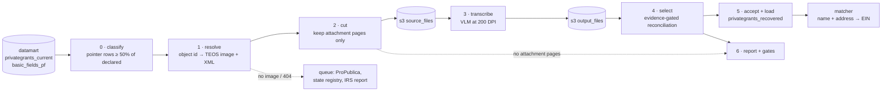

# Placeholder Grant Recovery — the pipeline, end to end

*Sketch, September 21, 2026. Builds on
[placeholder_grant_recovery.md](placeholder_grant_recovery.md), which holds
the evidence for every choice below. This is the shape of the thing to
build; nothing here is wired up yet beyond stages 1, 3 and 4.*

## The shape

Each stage writes one table or one S3 prefix, keyed on the IRS object id,
and never modifies an upstream one. Anything can be rerun from its input.

## Stages

### 0 · Classify — which filings need their PDF

**Input:** `privategrants_current` (2020+) joined to the declared total in
`basic_fields_pf` (Part I line 25, `arecgpdcprps`).
**Output:** `pf_placeholder_filings` — one row per filer-year: object id,
class, paid target, pointer text, classifier version.

The rule, measured in
[placeholder_classifier_assessment.sql](../data/exploratory/placeholder_classifier_assessment.sql):
a filing is **fetch** when pointer-named rows (`is_pointer()`, the broadened
pattern) hold at least half its declared total. Everything else gets a
class that says why not — *mixed*, *withheld* ("available upon request":
no PDF will help), *various* (no pointer; untested), *pass-through* (one
named recipient carrying the whole year), *itemised*. Patient-assistance
EINs and status-`I` rows are excluded here, by EIN and flag, never by name.

Over 2020–2025 that is ~13,000 fetch filings and $64.6B, of which ~4,600
filings are patient assistance. The organisational remainder is the
population: roughly 8,500 filings, $25–30B.

### 1 · Resolve — the IRS's own copies

**Input:** object ids from stage 0.
**Output:** `pf_recovery_manifest` — image URL, generation date, whether
RETURN_ID pinned it, XML URL, status (`staged`, `no_teos_image`,
`pdf_unavailable:404`), filer state.

[`irs_source.py`](../givingtuesday_datamart/irs_source.py) as it stands.
Two additions: pull the XML too (it is the authoritative source of both
targets, `TotalGrantOrContriPdDurYrAmt` and `TotalGrantOrContriApprvFutAmt`,
and of the filer's state), and route the failures. TEOS lists no image
for ~9% of filings and 404s another ~6%, all of the 404s images generated
in 2022. Those go to a queue, not to OCR: ProPublica's API for the older
image program (it had 2 of the sample's 15), the state registry by hand
for the largest (NY is CAPTCHA-gated), and one batch report to the IRS.

### 2 · Cut — send only the attachments

**Input:** the staged PDF.
**Output:** a subset PDF in `s3://…/source_files/<object_id>.pdf`, and a
page map (subset page → original page) in the manifest.

Every TEOS image is the IRS's rendering of the XML followed by the filer's
attachments. The IRS renders at a fixed 2246 px width, cropped; attachments
are full 2550×3300 pages or landscape sizes. `pdfimages -list` reads the
boundary without rendering and pypdf cuts without re-encoding. This is 53%
of pages on the sample (90% in band D), and it removes the exact pages
every false positive came from. A filing with zero attachment pages never
reaches OCR: it is *absent* by construction.

### 3 · Transcribe

A vision model reads each attachment page at 200 DPI and returns JSON:
the page's kind (paid list, future list, expenditure responsibility,
other), its heading, one row per recipient line, and the totals printed
on it. The bake-off below is why this replaces Unstructured's OCR job:
the best open model is exact on the clean and the dense rotated lists at
an eighth of the price, and it hands the selector two things OCR never
did — a label for every page and the page's own stated total, which is a
gate at page level before the filing-level one.

Volumes after the cut, at the sample's ~37 attachment pages per filing in
bands A–B and 2–6 in C–D:

| band | filings | attachment pages | note |
|---|---|---|---|
| A | 22 | done | census |
| B | 442 | ~16,000 | 44 done |
| C | 2,299 | ~14,000 | |
| D | 6,755 | ~14,000 | |

About 45,000 pages for the whole population, ten times the sample. Uncut
it would have been ten times that again. At Qwen3-VL's gateway price that
is roughly $80; at Gemini 3.5 Flash Lite's about $170; Unstructured
($0.015 a page after 10,000 free) would have been about $525.

### 4 · Select — the reconciliation gate

**Input:** `output_files/<object_id>.pdf.json`, the targets from the XML,
the page map.
**Output:** `pf_recovery_results` — per filing and per target (paid,
future): outcome, extracted sum, error, evidence (labelled / names),
whether a stated total matched, coverage, pages in original numbering,
selector version.

[`attachment_grants.py`](../givingtuesday_datamart/attachment_grants.py)
as rebuilt: a run needs reconciliation *and* a second class of evidence.
Paid and future reconcile separately. Failures are diagnosed — list
present, partial, absent — and *present* carries a coverage number, since
the largest failure class is a labelled list that OCR returned at 90–110%
of the target.

### 5 · Accept and load

**Output:** `privategrants_recovered` — one row per grant: filer, tax year,
object id, recipient name, address cells, amount, purpose, status; and
for lineage the PDF URL, original page number, OCR job id, selector
version, target reconciled against, and error. A view unions it with
`privategrants_current` for the matcher, tagged `match_source =
'ocr_recovery'`.

Two policies to set, in order:

1. **Reconciled** (≤ 0.5%): load. 29 of the 100 sample filings.
2. **Labelled, 90–110% covered**: load with coverage recorded, or re-OCR
   the failing pages first. 14 filings and $1.55B in the sample — a quarter
   of the money — and it is an OCR problem, not a selection problem. This
   decision waits on the ground-truth set (stage 6).

Future-payment lists (line 3b) are commitments, not payments. Capture
them; do not load them into a grants table.

### 6 · Report and gates

- **Ground truth:** 15 filings with rows counted from the PDF by hand.
  This is the only measurement of row-level precision the pipeline will
  have, and it sets the coverage policy.
- **Regression gate:** the old-versus-new harness over the 100-filing
  sample, run on every selector change. Two intermediate versions this
  session overcorrected to 27%; the harness is what caught them.
- **Canaries:** Siegel (reconciles to the dollar), Bezos 2022 (cash plus
  non-cash), Klarman (subtotals), Wells Fargo 2020 (blank-name total, OCR
  row loss), Hall (line 3a is list plus matching gifts plus scholarships).
- **The report** by band, plus the unreachable list with its routing.

## Do we need Unstructured? The bake-off

Fourteen attachment pages with known answers, through seventeen models on
the Vercel AI Gateway plus two OpenAI models, same prompt, JSON out. The
harness, reference and full table are in
[`exploratory/vlm_bakeoff/`](../givingtuesday_datamart/exploratory/vlm_bakeoff/).

| page set | truth |
|---|---|
| Siegel 2023, pages 31–39 | 110 rows, declared $26,907,603 to the dollar |
| Wells Fargo 2020, pages 100 and 233 | dense, rotated landscape; p233 is 20 rows to a printed $21,344,804.43 (verified by hand) |
| Klarman 2020, page 60 | program subtotals inline |
| Bezos 2022, pages 38 and 41 | non-cash: fair market value beside book value |

Scored on pages transcribed exactly, sums against the truths, and the share
of reference amounts found across all 14 pages. Prices are the gateway's
per-token rates on the day; Unstructured is $0.015 a page.

| model | Siegel pages exact | Siegel sum | WF p233 | amounts matched | $/page | vs Unstructured |
|---|---|---|---|---|---|---|
| Gemini 3.5 Flash Lite (200 DPI) | 9/9 | 100% | 20/20, exact | 89% | $0.0037 | 4× cheaper |
| Gemini 3.8 Flash | 9/9 | 100% | 20/20, exact | 94% | $0.0140 | parity |
| **Qwen3-VL instruct (200 DPI)** | 9/9 | 100% | 20/20, exact | 89% | $0.0018 | 8× cheaper |
| Qwen3-VL 235B | 9/9 | 100% | 20/20, +4.7% | 86% | $0.0016 | 9× cheaper |
| Ling 3.0 Flash VL (free tier) | 8/9 | 102% | 20/20, exact | 78% | $0 | free, slow |
| Llama 4 Maverick | 7/9 | 99% | 20/20, +1.2% | 73% | $0.0023 | 7× cheaper |
| gpt-5-mini | 8/9 | 88% | 16/20 | 46% | — | — |
| the rest (Gemma 4, Mistral Small, Nova 2 Lite, DeepSeek V4 vision, Haiku 4.5, Nemotron nano, GLM-4.5V, gpt-4.1) | 0–6/9 | 84–249% | — | 27–75% | | |

What it showed:

- **Yes, a vision model replaces Unstructured for attachment pages.**
  Qwen3-VL instruct and Gemini 3.5 Flash Lite, both at 200 DPI, reproduce
  the Siegel list to the dollar and the dense Wells Fargo page to the
  cent, at an eighth and a quarter of the price. They are identical on 11
  of the 14 pages; Qwen added no phantom row on the dense page and never
  truncated, Gemini handled the non-cash page better. Gemini 3.8 Flash is
  the most accurate overall, at Unstructured's price.
- **Resolution is not optional.** At 130 DPI Qwen misread two of twenty
  amounts on the Wells Fargo page (200 as 2,000; a leading 1 as 2). At
  200 DPI both went away, for 50% more input tokens.
- **Reasoning models refuse at random.** gpt-5-mini on the identical Siegel
  image returned 13 rows, then 0 rows labelled "other", then 13 again.
  Transcription wants a non-reasoning model, and a retry on empty output.
- **Some models invent amounts under confident names** — gpt-4.1 returned
  Siegel page 34 at $11.95M against $3.83M, Haiku 4.5 summed Siegel at
  249% of the truth. This is the failure the reconciliation gate exists
  for, and why the gate stays whatever transcribes the page.
- **The hard page is non-cash.** With fair market value beside book value
  every model mixed columns on some rows, and the long rows pushed two
  models past their JSON output limit. The fix is a column-specific
  instruction plus the page's own printed total: Qwen read "Total Non-Cash
  Contributions 88,203,692.86" correctly while getting rows wrong, so the
  page can flag itself.
- **The models transcribe printed totals and label the page.** That is
  most of the selector's heading heuristics done at the source, plus a
  page-level gate the OCR path never had.

Not measured here: name accuracy against ground truth (the reference is
Unstructured's rows), behaviour on 800-page filings, and gateway rate
limits at 45,000 pages. Those belong to the ground-truth set and the band
B run.

## Order of operations

1. Ground-truth set and a matcher pass on the 4,760 rows already
   recovered. Together they say whether the output is product-grade.
2. Wire stage 2 into `stage`, and stage 3 as a VLM call at 200 DPI
   through the gateway, with a retry on empty or truncated output and the
   page total checked against the rows. Run the 100-filing sample through
   **both** Qwen3-VL instruct and Gemini 3.5 Flash Lite (about 2,200
   attachment pages; $4 and $8) and let filing-level reconciliation choose:
   on the 14 bake-off pages they are identical on 11, Qwen is cleaner on
   the dense page and never truncated, Gemini is better on the non-cash
   page, and 14 pages cannot rank them. Qwen's open weights are the
   tie-breaker if it comes to one — it can run on Baseten or our own GPU
   with no data leaving our control.
3. Band B in full with the broadened classifier.
4. Decide the coverage policy; re-OCR band A's failing pages.
5. C and D once the per-page price is in hand.
6. Send GT the findings list; report the 2022 image batch to the IRS.

## Open decisions

- Whether recovered rows join `privategrants_current` or stay in their own
  table behind a view (recommended: the view; it keeps GT's data and ours
  separable and the matcher's input-shape version honest).
- Bumping `MATCHING_INPUT_SHAPE_VERSION` when recovered rows enter the
  matching views.
- The coverage acceptance threshold, after ground truth.
- What to do with "various" filers: twenty PDFs would tell.
- Whether GT will run any of this upstream; the lists are in images they
  already link to.
