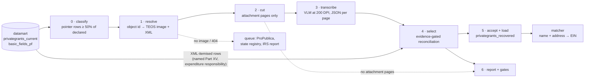

# Placeholder Grant Recovery — the pipeline, end to end

*Sketch, September 21, 2026. Builds on
[placeholder_grant_recovery.md](placeholder_grant_recovery.md), which holds
the evidence for every choice below. Stages 1–4 are wired up for the
100-filing sample (`placeholder_recovery.py`: `sample`, `stage`,
`transcribe`, `report`); stage 0 exists as SQL; stages 5 and 6 are not
built.*

## The shape

Each stage writes one table or one directory of files, keyed on the IRS object id,
and never modifies an upstream one. Anything can be rerun from its input.

## Stages

### 0 · Classify — which filings need their PDF

**Input:** `privategrants_current` (2020+) joined to the declared total in
`basic_fields_pf` (Part I line 25, `arecgpdcprps`).
**Output:** `pf_placeholder_filings` — one row per filer-year: object id,
class, paid target, pointer text, classifier version.

The rule, measured in
[placeholder_classifier_assessment.sql](../data/exploratory/placeholder_classifier_assessment.sql):
a filing is **fetch** when pointer-named rows (`is_pointer()`, the broadened
pattern) hold at least half its declared total. Everything else gets a
class that says why not — *mixed*, *withheld* ("available upon request":
no PDF will help), *various* (no pointer; untested), *pass-through* (one
named recipient carrying the whole year), *itemised*. Patient-assistance
EINs and status-`I` rows are excluded here, by EIN and flag, never by name.

Over 2020–2025 that is ~13,000 fetch filings and $64.6B, of which ~4,600
filings are patient assistance. The organisational remainder is the
population: roughly 8,500 filings, $25–30B.

### 1 · Resolve — the IRS's own copies

**Input:** object ids from stage 0.
**Output:** `pf_recovery_manifest` — image URL, generation date, whether
RETURN_ID pinned it, XML URL, status (`staged`, `no_teos_image`,
`pdf_unavailable:404`), filer state.

[`irs_source.py`](../givingtuesday_datamart/irs_source.py) as it stands.
Two additions: pull the XML too (it is the authoritative source of both
targets, `TotalGrantOrContriPdDurYrAmt` and `TotalGrantOrContriApprvFutAmt`,
and of the filer's state), and route the failures. TEOS lists no image
for ~9% of filings and 404s another ~6%, all of the 404s images generated
in 2022. Those go to a queue, not to OCR: ProPublica's API for the older
image program (it had 2 of the sample's 15), the state registry by hand
for the largest (NY is CAPTCHA-gated), and one batch report to the IRS.

### 2 · Cut — send only the attachments

**Input:** the staged PDF.
**Output:** in the manifest, the page the filer's attachments start on
and how many there are (`attachment_from`, `attachment_pages`).

Every TEOS image is the IRS's rendering of the XML followed by the
filer's attachments. The IRS renders at five fixed image widths (2246 px
form pages; 2259, 2440, 3062 and 3081 px supporting statements), cropped
to content; attachments are full 2550×3300 pages or whatever the scanner
produced. `pdfimages -list` reads the boundary without rendering
(`irs_source.attachment_start`), and only the pages after it are rendered
for the model. On the sample that is 1,782 of 4,746 pages (38%): half the
pages in bands A and B, 7% in C, 1% in D. Twenty-six of the 85 staged
filings have no attachment page at all and are *absent* by construction —
no model call, no false positive from the form's own money tables.

The cut removes one thing the OCR selector had been leaning on: the
IRS-rendered **expenditure-responsibility statement**. Two OCR
reconciliations (Cohen 2020, Anschutz 2022) were the attachment's list
*plus* that statement — Unstructured had lost the attachment's own page
carrying the $85M to Cohen Veterans Network, and the statement filled the
hole. Those rows are in the XML — GT's extract has them as
`990PF_EXPENDITURE_RESP`, and a few placeholder filers also name some
Part XV grants — so stage 4 takes the XML's itemised rows as exact tables
beside the transcribed pages, and the subset search decides whether they
belong in the sum. `sample` writes them for the 100 filings
(`placeholder_sample_xml_rows.csv`: 116 rows across 26 filings); in
production they come from `privategrants_current`. With the models reading
the attachment correctly, Cohen and Anschutz reconcile from the attachment
alone; Hall 2023 is the filing where the XML rows closed the gap.

### 3 · Transcribe

**Input:** the attachment pages, rendered at 200 DPI.
**Output:** one JSON file per page — its kind (paid list, future list,
expenditure responsibility, other), its heading, one row per recipient
line (name, address, status, purpose, amount) and the totals printed on
it — plus token usage, finish reason and attempt count.

[`vlm_transcription.py`](../givingtuesday_datamart/vlm_transcription.py)
through the Vercel AI Gateway. The prompt is versioned and every stored
page carries the version that produced it; results go to
`<model>-<version>` folders so a revision is scored against the last one.
v3 (from the sample) says what a heading is — the list title, not the
filer masthead Gemini put there or the recipient line Qwen did — keeps a
contact person inside their organisation's row, and asks for one row per
recipient however many printed lines it wraps onto.

Three retries, each for a failure the runs showed: a transport error
waits and asks again (on top of the SDK's own); output cut off at the
token limit is re-asked with twice the room; a page the model labelled a
grant list but returned no rows for, or stopped mid-row on, is asked
again **without JSON mode**, and the fullest parsed answer is kept. That
last one came from the sample: Qwen answered 401 dense list pages with an
empty list in five seconds each — 384 of Johnson & Johnson's 836, 7 of
First Horizon's 30 — twice each, under `response_format=json_object`;
the same pages read at 59–87 rows without it, five of five tried, and no
prompt wording changed that. Every page also gets a **page-level check**:
do its rows sum to a total printed on it? Matched pages need no further
look; a mismatch is a flag, not a verdict, since printed totals are often
cumulative.

Volumes after the cut, from the sample's attachment pages per filing
(30.7 in band A, 30.6 in B, 1.9 in C, 0.3 in D):

| band | filings | attachment pages |
|---|---|---|
| A | 22 | 584 (done) |
| B | 442 | ~13,500 |
| C | 2,299 | ~4,300 |
| D | 6,755 | ~2,000 |

About 20,000 pages for the whole population, eleven times the sample.
Uncut it would have been 2.6 times that; the earlier estimate of 45,000
counted the wide IRS statements as attachments. At the gateway's prices
that is about $36 with Qwen3-VL instruct and $74 with Gemini 3.5 Flash
Lite; Unstructured ($0.015 a page after 10,000 free) would have been
about $150.

### 3b · Agree — the page gate

**Input:** two readings of every page. **Output:** one accepted reading
per page, or a flag.

Decided on the ground truth (see *Third reader* below). Qwen3-VL
instruct and Gemini 3.5 Flash Lite read every page. A page they agree
on — the same (name, amount) pairs, at least one row — is accepted: that
was exactly right on 107 of 107 checked pages. A disputed page, or one
both returned empty, goes to Gemini 3.8 Flash; if it matches either base
reading the page is accepted. What is still open goes to Claude Sonnet
5, thinking off, and is accepted if it matches any earlier reading. A
page no two readers agree on is flagged; under the policy as built
(`POLICY_V1` in [`page_verdicts.py`](../givingtuesday_datamart/page_verdicts.py),
its `flagged` rule `load_single`) it is loaded from Sonnet's single
reading with the verdict as the mark, and `leave_out` is the
alternative. Agreement counts only between different models: a model
read twice repeats its own mistakes (Gemini wrong on 6 of 57
self-agreements, Qwen on 14 of 51).

On the 83 ground-truth pages this accepts 58 rightly, 2 wrongly and
flags 23; the two wrong accepts are future-payment schedules with three
money columns, where three readers agreed on the approved amount and
the declared figure is the balance. On paid pages no policy accepted a
wrong page. Cost on the expanded frame, at the measured 52% dispute
rate: about $360, against $190 for 3.8 Flash alone (52 right, 30
flagged) and $84 for the base pair alone. Run on the 100-filing sample as the
rehearsal for the 1,000-filing run it cost $63 and projects the frame
at about $330; with 3.8 Flash at low reasoning effort (`POLICY_V2`, the
run's policy) about $270 (*Sample under POLICY_V1* below).

### 4 · Select — the reconciliation gate

**Input:** the per-page JSON, the XML-itemised rows, the targets from
the XML, the page map.
**Output:** `pf_recovery_results` — per filing and per target (paid,
future): outcome, extracted sum, error, evidence (labelled / names),
whether a stated total matched, coverage, pages in original numbering,
selector version.

[`attachment_grants.py`](../givingtuesday_datamart/attachment_grants.py)
as rebuilt: a run needs reconciliation *and* a second class of evidence.
Three producers feed one selector: `candidate_tables` (Unstructured
elements, the baseline), `page_tables` (a model's page JSON — the heading
is the context exactly as an OCR heading was, and the page kind is a
second, independent label) and `xml_tables` (the itemised rows, exact,
one table per source); `extract_tables` reconciles whatever mix it is
given. A page whose heading says nothing, and which the model labels a
list, inherits the previous page's heading and kind — the models cannot
tell a paid continuation from a future one, and both called Kenan's
second future-payment page a paid list — unless that previous page closed
its list with a total equal to a declared amount, in which case the next
page opens a new statement. A page the model calls *other* never
inherits.
Paid and future reconcile separately. Failures are diagnosed — list
present, partial, absent — and *present* carries a coverage number, since
the largest failure class is a labelled list that OCR returned at 90–110%
of the target.

### 5 · Accept and load

**Output:** `privategrants_recovered` — one row per grant: filer, tax year,
object id, recipient name, address cells, amount, purpose, status; and
for lineage the PDF URL, original page number, OCR job id, selector
version, target reconciled against, and error. A view unions it with
`privategrants_current` for the matcher, tagged `match_source =
'ocr_recovery'`.

Two policies to set, in order:

1. **Reconciled** (≤ 0.5%): load. 29 of the 100 sample filings.
2. **Labelled, 90–110% covered**: load with coverage recorded, or re-OCR
   the failing pages first. 14 filings and $1.55B in the sample — a quarter
   of the money — and it is an OCR problem, not a selection problem. This
   decision waits on the ground-truth set (stage 6).

Future-payment lists (line 3b) are commitments, not payments. Capture
them; do not load them into a grants table.

### 6 · Report and gates

- **Ground truth:** pages read from the image by hand and scored on
  (name, amount) pairs — done for 83 pages, see *Ground truth* below.
  This is the only measurement of row-level precision the pipeline has,
  and it sets the acceptance policy.
- **Regression gate:** the old-versus-new harness over the 100-filing
  sample, run on every selector change. Two intermediate versions this
  session overcorrected to 27%; the harness is what caught them.
- **Canaries:** Siegel (reconciles to the dollar), Bezos 2022 (cash plus
  non-cash), Klarman (subtotals), Wells Fargo 2020 (blank-name total, OCR
  row loss), Hall (line 3a is list plus matching gifts plus scholarships).
- **The report** by band, plus the unreachable list with its routing.

## Do we need Unstructured? The bake-off

Fourteen attachment pages with known answers, through seventeen models on
the Vercel AI Gateway plus two OpenAI models, same prompt, JSON out. The
harness, reference and full table are in
[`exploratory/vlm_bakeoff/`](../givingtuesday_datamart/exploratory/vlm_bakeoff/).

| page set | truth |
|---|---|
| Siegel 2023, pages 31–39 | 110 rows, declared $26,907,603 to the dollar |
| Wells Fargo 2020, pages 100 and 233 | dense, rotated landscape; p233 is 20 rows to a printed $21,344,804.43 (verified by hand) |
| Klarman 2020, page 60 | program subtotals inline |
| Bezos 2022, pages 38 and 41 | non-cash: fair market value beside book value |

Scored on pages transcribed exactly, sums against the truths, and the share
of reference amounts found across all 14 pages. Prices are the gateway's
per-token rates on the day; Unstructured is $0.015 a page.

| model | Siegel pages exact | Siegel sum | WF p233 | amounts matched | $/page | vs Unstructured |
|---|---|---|---|---|---|---|
| Gemini 3.5 Flash Lite (200 DPI) | 9/9 | 100% | 20/20, exact | 89% | $0.0037 | 4× cheaper |
| Gemini 3.8 Flash | 9/9 | 100% | 20/20, exact | 94% | $0.0140 | parity |
| **Qwen3-VL instruct (200 DPI)** | 9/9 | 100% | 20/20, exact | 89% | $0.0018 | 8× cheaper |
| Qwen3-VL 235B | 9/9 | 100% | 20/20, +4.7% | 86% | $0.0016 | 9× cheaper |
| Ling 3.0 Flash VL (free tier) | 8/9 | 102% | 20/20, exact | 78% | $0 | free, slow |
| Llama 4 Maverick | 7/9 | 99% | 20/20, +1.2% | 73% | $0.0023 | 7× cheaper |
| gpt-5-mini | 8/9 | 88% | 16/20 | 46% | — | — |
| the rest (Gemma 4, Mistral Small, Nova 2 Lite, DeepSeek V4 vision, Haiku 4.5, Nemotron nano, GLM-4.5V, gpt-4.1) | 0–6/9 | 84–249% | — | 27–75% | | |

What it showed:

- **Yes, a vision model replaces Unstructured for attachment pages.**
  Qwen3-VL instruct and Gemini 3.5 Flash Lite, both at 200 DPI, reproduce
  the Siegel list to the dollar and the dense Wells Fargo page to the
  cent, at an eighth and a quarter of the price. They are identical on 11
  of the 14 pages; Qwen added no phantom row on the dense page and never
  truncated, Gemini handled the non-cash page better. Gemini 3.8 Flash is
  the most accurate overall, at Unstructured's price.
- **Resolution is not optional.** At 130 DPI Qwen misread two of twenty
  amounts on the Wells Fargo page (200 as 2,000; a leading 1 as 2). At
  200 DPI both went away, for 50% more input tokens.
- **Reasoning models refuse at random.** gpt-5-mini on the identical Siegel
  image returned 13 rows, then 0 rows labelled "other", then 13 again.
  Transcription wants a non-reasoning model, and a retry on empty output.
- **Some models invent amounts under confident names** — gpt-4.1 returned
  Siegel page 34 at $11.95M against $3.83M, Haiku 4.5 summed Siegel at
  249% of the truth. This is the failure the reconciliation gate exists
  for, and why the gate stays whatever transcribes the page.
- **The hard page is non-cash.** With fair market value beside book value
  every model mixed columns on some rows, and the long rows pushed two
  models past their JSON output limit. The fix is a column-specific
  instruction plus the page's own printed total: Qwen read "Total Non-Cash
  Contributions 88,203,692.86" correctly while getting rows wrong, so the
  page can flag itself.
- **The models transcribe printed totals and label the page.** That is
  most of the selector's heading heuristics done at the source, plus a
  page-level gate the OCR path never had.

Not measured here: name accuracy against ground truth (the reference is
Unstructured's rows). Behaviour on an 800-page filing and gateway
throughput were measured on the sample run below.

## The sample through both models

The whole 100-filing sample, every attachment page (1,782), through both
finalists at 200 DPI, scored by the same selector as the Unstructured
baseline. Per-filing detail is in `data/exploratory/placeholder_report_*.csv`
and the filing-by-filing differences in `placeholder_engine_differences.csv`
(`placeholder_recovery.py compare`).

The sample has now been read twice by each model — once under prompt v2,
once under v3 with the no-JSON retry — and all four reads are scored by
the current selector (the continuation-page rule included).

| band | Unstructured | Qwen v2 | Gemini v2 | Qwen v3 | Gemini v3 | any of the four |
|---|---|---|---|---|---|---|
| A (22) | 10 / $1,326M | 14 / $2,357M | 14 / $2,483M | 14 / $2,453M | 15 / $2,544M | 16 / $2,693M |
| B (44) | 15 / $505M | 13 / $330M | 17 / $417M | 14 / $344M | 16 / $402M | 20 / $492M |
| C (22) | 3 / $10M | 7 / $20M | 7 / $20M | 7 / $20M | 7 / $20M | 7 / $20M |
| D (12) | 1 / $0.0M | 2 / $0.3M | 2 / $0.3M | 2 / $0.3M | 2 / $0.3M | 2 / $0.3M |
| **all** | **29 / 30.4%** | **36 / 44.6%** | **40 / 48.2%** | **37 / 46.4%** | **40 / 48.9%** | **45 / 52.9%** |

Reconciled filings and declared dollars credited; percentages are of the
sample's $6,064M. The v3 pair alone reaches 42 / 51.8%; with the OCR pass
added, 51 filings and 55.9% reconcile under some engine. (The first
report of this table, before the continuation-page rule, read 35 / 44.0%
and 38 / 44.3%.) The present-but-90–110% backlog fell from 24.7% of
dollars under Unstructured to 4.4–4.6% under either model's second read.

The number to quote is a single read's: 36–40 filings, 45–49% of dollars.
The union climbs with every read because each read is a different draw
on the dense pages — see *The second read* below — and a union chosen
after the fact, with reconciliation as the only check, is not a method.

| | Qwen3-VL instruct | Gemini 3.5 Flash Lite |
|---|---|---|
| cost, 1,782 pages | $3.57 ($0.0020/page) | $12.37 ($0.0069/page) |
| tokens per page | 4,460 (2,830 in / 1,630 out) | 4,030 (1,430 in / 2,610 out) |
| latency per page | median 33 s, p90 70 s | median 8 s, p90 10 s |
| throughput | 41 pages/min at 40 workers | 80 pages/min at 12 workers |
| pages needing a retry | 485 (mostly an empty first answer on a list page) | 22 |
| pages left partial | 55, all Johnson & Johnson | 1 |
| rows transcribed | 51,894 | 86,205 |

Gemini's row count is higher because it splits multi-line entries and, on
one filing, lists a contact name under each organisation as its own row.

What it showed:

- **Both models beat OCR by the same margin on the same filings.** The
  three Schusterman years, Wells Fargo 2020, King Street, Offield, Milias,
  Reynolds, Waldheim, Lola Wright and Paul Pigott move from
  *present-but-short* (or *absent*) to reconciled under both. Cohen and
  Anschutz reconcile from the attachment alone; Hall 2023 reconciles under
  Qwen with the XML's two expenditure-responsibility rows added, which is
  the case stage 2 anticipated.
- **They fail on different filings, so the union is worth 5 points.**
  Eleven filings reconcile under exactly one model (Siegel 2022, Hall
  2023, Wells Fargo 2021 and Raskob only under Qwen; Wyss 2023, Roberts
  2022, King Street 2021, Aviv, Humana, Pacific Life and Edelman only
  under Gemini). Two passes at $16 a sample are still a tenth of
  Unstructured's price, and page-level agreement between them is the
  obvious next gate.
- **Seven OCR reconciliations are lost under one or both models**, all as
  *present* at 96–113% coverage: Bezos 2022 (non-cash, the known hard
  page), Kenan 2021 (dense 62-row pages, both misread amounts), Pritzker
  2023, Siegel 2022 (Gemini duplicated two rows on one page), Pritzker
  Traubert 2022 (one $200K row doubled), Eden Hall 2023, Claude Moore
  2021 (Gemini emitted the contact person under each grantee as a second
  row). Each is a transcription-shape error the page's own printed total
  exposes: Siegel, Pritzker Traubert and Claude Moore all print the
  declared total on their last page and the rows come in 1–12% off it.
- **Pages the models label wrongly are continuation pages.** Kenan's
  future-payment list runs onto a page with no heading, and both models
  called that page a paid list; the selector's paid target then fails.
  The OCR path carried the previous page's heading forward for exactly
  this; the page-JSON path needs the same rule.
- **JSON breaks in predictable ways.** Gemini writes amounts as printed
  (`$151,000.00`, `1,500000.0`) inside otherwise valid JSON on 9 pages;
  Qwen stops mid-row on 55 of Johnson & Johnson's 836 matching-gift pages
  while reporting a normal finish. The parser now quotes bare amounts and
  salvages the complete rows of a truncated response, flagged `_partial`,
  so neither needs a recall; the J&J filing stays *present* at 88–97%
  under every engine.
- **The 26 filings with no attachment pages cost nothing** and account
  for most of the baseline's *list absent* outcomes, confirmed rather than
  inferred.

### The second read

Prompt v3 and the no-JSON retry, both models, the same 1,782 pages:
Qwen $4.24 and 65,793 rows (51,894 under v2 — 1,314 pages were answered
without JSON mode and none was left partial); Gemini $12.21 and 85,939
rows, no retries. Filing by filing, each model gained and lost in
roughly equal measure. Gemini: +Bezos 2023 (the non-cash page, read
right this time), Hall 2023, Manton, Kenan's future list; −Wyss 2023,
Roberts 2022, Edelman 2023. Qwen: +Wyss 2023, Aviv, Pacific Life,
Elbridge Stuart's future list, and First Horizon from 61% to 102%
coverage; −Hall 2023, Kenan's future list, Raskob.

Comparing the two reads page by page says why. Two readings of a page
are compared on their (name, amount) pairs; J&J's 836 pages are excluded.

| rows on the page | pages | same model, v2 vs v3: pairs identical | Qwen v3 vs Gemini v3: pairs identical |
|---|---|---|---|
| under 10 | ~148 | 91–97% | 80% |
| 10–24 | ~330 | 89–93% | 83% |
| 25–49 | ~280 | 36–37% | 15% |
| 50 and up | ~110 | 31–38% | 25% |

Below 25 rows a page, a reading is reproducible and the two models
agree. From 25 rows up, the same model reads the same page differently
on two occasions more often than not, and the two models agree on one
page in six. **Every read is a different draw on the dense pages.** The
filing-level numbers above follow from this: a single read lands at
36–40, and the union of four draws at 45.

Three of the dense-page shapes were confirmed against the page images:

- **A merge shifts every amount below it.** On Wyss 2023 p033 (21 rows),
  Gemini v3 read "Special Olympics Pennsylvania" and "States Newsroom" as
  one wrapped name; ARC of Chester County then received States Newsroom's
  $1,140,000, the Conservation Alliance received ARC's $50,000, and the
  $5,000,000 at the bottom fell off. The page sum moved by one row while
  every row after the merge was wrong. v3's own wording ("a name that
  wraps onto a second line is still one row") caused it; v4 anchors rows
  on the amount column instead and reads the page exactly under both
  models.
- **A split shifts the other way.** Gemini v2 on Roberts 2022 p034 and
  Wells Fargo 2020 p026 gave an address line its own row, so Metropolitan
  Economic Development Association received Neighborhood Reinvestment's
  $1,478,885.
- **Cents folded into dollars.** Gemini v3 read "$838,000.00" on Wells
  Fargo p026 as 8,383,000, a $7.5M phantom on one row.

Qwen was exact on both of those pages. The consequence for the design:
the reconciliation gate cannot see a shift — 0.5% of Wells Fargo's $299M
is $1.5M of slack — so stage 3b must compare (name, amount) pairs, not
amount lists, and the ground-truth set must score pairs. The ground-truth
set, next, confirmed both.

### Sample under POLICY_V1

The same 1,782 pages decided by the page gate as built (`POLICY_V1`, the
*3b · Agree* design: Qwen and Flash Lite read every page under prompt v4,
disputes go to 3.8 Flash and then Sonnet 5, a page no two readers agree
on is loaded from Sonnet's reading marked `flagged`), on 2026-09-23 as
the dress rehearsal for the 1,000-filing run (the operational facts —
wall time, throughput, the empty-cache path, the stop — are the
*Rehearsal run* note under *Order of operations*, item 4). The base pair
bought 1,699 pages each (the 83 ground-truth pages were stored), 3.8
Flash 1,147, Sonnet 501; **$63.07 in all**, against a pre-run estimate of
$80. Per-filing detail is `data/exploratory/placeholder_report_v1.csv`.

| band | Unstructured | Qwen v3 | Gemini v3 | any of the four reads | **POLICY_V1** | v1, flagged pages left out |
|---|---|---|---|---|---|---|
| A (22) | 10 / $1,326M | 14 / $2,453M | 15 / $2,544M | 16 / $2,693M | **15 / $2,664M** | 11 / $1,851M |
| B (44) | 15 / $505M | 14 / $344M | 16 / $402M | 20 / $492M | **21 / $542M** | 15 / $383M |
| C (22) | 3 / $10M | 7 / $20M | 7 / $20M | 7 / $20M | **9 / $30M** | 7 / $20M |
| D (12) | 1 / $0.0M | 2 / $0.3M | 2 / $0.3M | 2 / $0.3M | **2 / $0.3M** | 2 / $0.3M |
| **all** | **29 / 30.4%** | **37 / 46.4%** | **40 / 48.9%** | **45 / 52.9%** | **47 / 53.4%** | **35 / 37.2%** |

Reconciled filings and declared dollars credited, as in the table above
(the v2 columns are there). The policy reaches 47 filings and 53.4% —
above any single read and above the after-the-fact union of four, and
this time as a method: every accepted page names the two readings that
agreed on it, or is marked. The projected recovery across the addressable
population is $10.37B. The last column is the same verdicts re-read under
`leave_out` (`--flagged leave_out`, 13 s, no call): without the flagged
pages 35 filings and 37.2%, so **the flagged rule is worth 12 filings and
16 points on this sample**, and those 12 rest on Sonnet's single reading,
which the ground truth puts right on 11 of 23 such pages. The
reconciliation gate is what accepts them — the rows sum to the declared
total within 0.5% — and it cannot see a shifted name against a right
amount, so the mark matters; 5,976 of the 18,436 rows the report loads
come from flagged pages, 4,990 of them Wells Fargo's two years (2021: 64
of its 65 pages flagged, the tiny-print 61-row statements the ground
truth found no base reader exact on).

**The verdict mix**, by stratum and overall (`report --policy v1` and
`page_verdicts status --policy v1`):

| band | pages | agreed | escalated | flagged | rows from flagged pages |
|---|---|---|---|---|---|
| A | 584 | 263 | 188 | 133 | 5,314 |
| B | 1,161 | 301 | 622 | 238 | 513 |
| C | 34 | 22 | 5 | 7 | 149 |
| D | 3 | 3 | 0 | 0 | 0 |
| **all** | **1,782** | **589** | **815** | **378** | **5,976** |

No page was `unreadable` and none was left without a verdict. By
accepted reading: Qwen 589 (the agreed pages, the first base reader's
by rule), 3.8 Flash 662, Sonnet 153 escalated and 378 flagged.

**The dispute rate under v4**, and what each escalation stage resolved:

| | pages | disputed by the base pair | 3.8 Flash resolved | Sonnet resolved | flagged |
|---|---|---|---|---|---|
| Johnson & Johnson 2021 (836 pages) | 836 | 735 (87.9%) | 507 (69% of disputes) | 50 (22% of the 228 still open) | 178 (21%) |
| the other 58 filings | 946 | 458 (48.4%) | 155 (34%) | 103 (34% of 303) | 200 (21%) |
| **all** | **1,782** | **1,193 (66.9%)** | **662 (55%)** | **153 (29% of 531)** | **378 (21%)** |

The dispute rate is the v3 rate to the point — 67% / 87% / 49% under
v3, 66.9% / 87.9% / 48.4% under v4 — so the prompt did not move it, and
the 83-page ground-truth set (46 of 83 disputed, enriched for them) had
the shape right. What the ground truth under-called is 3.8 Flash's
share: it resolved 35% of the checked disputes (16 of 46) and 55% here,
because J&J's dense single-column pages are disputes Qwen creates (305
of J&J's 836 came back partial from Qwen, none from anyone else) and
3.8 Flash matches Flash Lite on seven in ten of them; outside J&J the
34% is the ground truth's number. Re-weighted to the 9,347-page frame,
where J&J is 836 pages of 9,347 rather than of 1,782: a 52% dispute rate
(4,856 pages), 3.8 Flash resolving 39%, Sonnet a third of the 2,954
still open, about 1,980 pages flagged (21%), and at the measured
per-page prices (Qwen $0.0024, Flash Lite $0.0070, 3.8 Flash $0.0216,
Sonnet $0.0459) **about $330: base pair $88, 3.8 Flash $105, Sonnet
$136** — 9% under the *3b · Agree* section's $360, which used the
scorer's per-page costs and a 52% dispute rate from the same
re-weighting of v3. That is v1 as run. Under `POLICY_V2`, 3.8 Flash at
low reasoning effort (the *Ground truth* section's table: $0.0093 a
page, 17 of 46 disputes resolved against 16, so the Sonnet stage is no
larger), the Flash stage is **about $45 and the frame about $270**.

**Per model** on the pages this run bought, from the rows' `usage`,
`seconds` and `attempts`:

| reader | pages bought | tokens a page (in / out) | $ a page | $ | median / p90 latency | calls a page | partial |
|---|---|---|---|---|---|---|---|
| Qwen3-VL instruct | 1,699 | 3,150 / 2,020 | $0.0024 | 4.09 | 48 s / 70 s | 1.40 | 303 |
| Gemini 3.5 Flash Lite | 1,699 | 1,760 / 2,580 | $0.0070 | 11.88 | 7.9 s / 10.6 s | 1.00 | 1 |
| Gemini 3.8 Flash | 1,147 | 1,760 / 5,400 | $0.0216 | 24.68 | 25.7 s / 38.3 s | 1.09 | 3 |
| Claude Sonnet 5 | 501 | 5,630 / 3,460 | $0.0459 | 22.43 | 24.5 s / 41.7 s | 1.00 | 0 |

Qwen's 1.40 calls a page is the retry ladder on J&J: 303 pages asked
three times each because the model stopped mid-row at a normal finish,
the fullest salvage kept and marked partial (355 such pages under v3, 55
under v2; v4 is read without JSON mode from the first call, and the
empty-list answers of v2 are gone). 3.8 Flash reports 1.8 times Flash
Lite's output tokens on the same 1,147 pages while returning the same
text — 7,270 against 7,200 characters a page, the same name, address and
purpose lengths — so the difference is tokens the model spends before
it answers, reported inside the completion count and billed; that, at
1.5 times Flash Lite's output price, is why it costs three times as
much a page. `reasoning_effort` moves them, one way or the other (both
tried on the 83 ground-truth pages under a request hash each,
2026-09-23; the *Ground truth* section's table). `none` makes it worse:
3.8 Flash then answered 24 pages on the first call against 64 by
default, the retry ladder re-asked the rest, 7 pages ran to the
32K-token limit and came back partial, output tokens a page went from
5,520 to 12,840, the cost from $0.022 to $0.050 a page and the median
latency from 26 s to 56 s, for no gain (96.6% precision and 91.1%
recall against 94.2% / 94.0%, 58 of 83 exact against 59). `low` makes
it better on every axis: 2,130 tokens a page, $0.0093, 12 s median, one
call a page, 62 of 83 exact, 96.5% / 96.3%, the pairs identical to the
default's on 64 of 83 and, where they differ, the truth siding with
`low` on 5 pages and the default on 2. `low` is the default from that
date and `POLICY_V2` reads under it; the verdicts above are v1's, at
the default effort, and v1 pins those readings. One caveat on
every dollar figure here: the rows were stored while a row's `usage`
was the kept attempt's tokens, so the retry ladder's other calls are
not in them — about 800 of the rehearsal's 5,844 calls, roughly $4 on
top of the $63 the rows report, a 6% understatement. From 2026-09-23
`transcribe` sums the tokens of every call it makes for a page, so a
row's `usage` is what the page cost (Zein's call); the rows stored
before that date — the sample's v2, v3 and v4 reads, the rehearsal's —
keep the kept attempt's.

**Filings that changed outcome against the v3 single reads** (15 of the
100; `compare`): v1 gains Kenan 2021, Roberts 2022, Eden Hall 2023,
Edelman 2023, Claude Moore 2021, Thome 2022 and Brown Dana 2022 over
both v3 reads, and takes each read's own gains from the other — Wyss
2023 and Siegel 2022 (Qwen's), Bezos 2023, Manton and King Street 2021
(Gemini's); it loses Hall 2023 and Humana 2023, which Gemini v3 alone
had. The three largest by declared amount:

- **Bezos 2023, $157.0M** (Qwen v3 partial at 12% coverage, Gemini v3
  reconciled, v1 reconciled). The non-cash filing, the bake-off's hard
  page: fair market value beside book value. All six pages are
  `flagged` — on the three dense pages every reader returns 43–47 rows
  and a different sum, and on the two big pages (66–70 rows, $100M and
  $39M) Qwen v4 returns nothing at all, as Qwen v3 did — and Sonnet's
  five readings sum to $156.95M against $156.96M declared, 0.010% off,
  so the filing reconciles from single readings and carries 243 marked
  rows. Under `leave_out` it is *list absent*.
- **Wyss 2023, $149.3M** (Qwen v3 reconciled, Gemini v3 present at
  120%, v1 reconciled to the dollar). Twelve pages, 134 rows: five
  agreed by the base pair; six escalated — 3.8 Flash matching Qwen on
  two paid pages (p033 among them, the page the *second read* section
  shows Gemini v3 merging two names on; under v4 three readers read it
  the same) and Flash Lite on the three expenditure-responsibility
  pages, where Qwen reads a different column, and Sonnet matching 3.8
  Flash on the first page, where Flash Lite dropped a row; and one
  flagged (p030: Qwen and Flash Lite return 21 rows and the same $10.52M
  but not the same name keys, 3.8 Flash reads $9.85M, and Sonnet's 21
  rows are loaded).
- **Hall 2023, $101.7M** (Qwen v3 present at 126%, Gemini v3
  reconciled at 0.28% error with the XML's two rows, v1 present at
  315%). The canary whose line 3a is a list plus matching gifts plus
  scholarships. Its five paid-list pages (24–49 rows each) are read
  differently by every reader — no two of the four agree on any of
  them, and Flash Lite v4 puts $884M on p037 where the others put
  $8–27M — so all five are `flagged` and Sonnet's readings are loaded,
  and they carry two of their own outliers ($27.5M on p037 and $84.0M on
  p038 against $8–17M from the other three): the sum is 3.1 times the
  target and no subset reconciles. The two future-list pages are agreed
  or escalated, and p043 is one of the two ground-truth pages the
  policy accepts wrongly (the approved amount, three readers agreeing).
  Gemini v3's reconciliation of this filing was one draw of the lottery
  the *second read* section describes, inside the 0.5% tolerance by
  0.22 points; the gate's refusal to accept a page no two readers agree
  on is working as designed here, and `load_single` then loads readings
  the selector rightly cannot use.

### The 1,000-filing frame under POLICY_V2

The frame — 1,000 filings of 677 filers, 831 with a PDF, 553 with an
attachment, 9,926 attachment pages — decided by the page gate as
`POLICY_V2` (3.8 Flash at low reasoning effort, otherwise v1) on
2026-09-23/24, on the EC2 box through `run` (the operational facts —
the box, the stops, two races the chunked renders exposed, wall time and
throughput — are the *Frame run* note under *Order of operations*, item
4). The base pair bought 7,613 and 7,606 pages, 3.8 Flash 5,959, Sonnet
2,953; **$221.64 in all**, against a pre-run projection of $241.50 and
the session's $400 cap. Per-filing detail is
`data/exploratory/placeholder_report_v2_1000.csv`; the sample's own v2
report is `placeholder_report_v2.csv`.

| band | filings | readable | **POLICY_V2** | of all filings | of readable | dollars, of all | dollars, of readable | v2, flagged pages left out |
|---|---|---|---|---|---|---|---|---|
| A (over $100M) | 22 | 17 | **15 / $2,664M** | 68% | 88% | 57.0% | 83.4% | 12 / $2,001M |
| B ($10M–$100M) | 438 | 281 | **201 / $5,299M** | 46% | 72% | 46.4% | 71.2% | 148 / $3,884M |
| C | 137 | 64 | **51 / $177M** | 37% | 80% | 39.5% | 75.9% | 42 / $132M |
| D | 403 | 191 | **140 / $36.5M** | 35% | 73% | 36.7% | 73.8% | 131 / $33.8M |
| **all** | **1,000** | **553** | **407 / $8,177M** | **41%** | **74%** | **49.1%** | **74.9%** | **333 / 36.4%** |

Reconciled filings and declared dollars credited, on two denominators:
every filing in the band, and the *readable* ones — a PDF served by the
IRS with something attached by the filer. **407 filings and 49.1% of
the $16.6B declared**, 235,622 grant rows; of the 553 readable filings,
74%, and 74.9% of their $10.9B. The gap between the two denominators is
data acquisition — the IRS's missing images and the filers' empty
attachments — and it is what makes the band gradient: the readers
reconcile 72–88% of readable filings in every band, but 77% of band A
is readable against 64% of B and 47% of C and D. The gap between the
readable rate and 100% is the pipeline's: the 77 *list present*, 23
*list partial* and 44 *no candidate table* filings below. The projected
recovery across the addressable population is $11.41B (the sample had
projected $10.37B).
The last column is the same verdicts under `leave_out` (no call): the
flagged rule is worth 74 filings and 12.7 points on the frame, against
12 filings and 16 points on the sample, and 36,442 of the rows (15%)
come from flagged pages and carry the mark.

By where a filing came from: the 100-filing sample 47 / 53.4% — the
same 47 filings and dollars as under v1, `compare` finding no filing
whose outcome differs, although 74 of its 1,782 page verdicts changed
(30 escalated to flagged, 27 the other way, 17 a different accepted
reader); the other 510 of the 610, 229 / 46.9%; the 390 top-up in bands
C and D, 131 / 35.2%.

**What is not recovered.** 447 filings, 34.4% of the declared dollars,
have nothing to read: 278 whose PDF is the IRS rendering and nothing
else ($3.08B, 18.5%), 66 whose TEOS image is a 404 ($1.48B), 103 with no
TEOS image at all ($1.17B). Of the 553 read: 77 *list present* but not
reconciled ($1.38B, 8.3%), 23 *list partial* ($729M), 44 with no
candidate table ($532M), 2 *list absent*. Pages with a stated total:
298 matched, 694 did not.

**The verdict mix, and where the projection missed.** Of the 9,926
pages: agreed 3,920 (39.5%), escalated 3,161 (31.8%: 3.8 Flash 2,538,
Sonnet 623), flagged 2,845 (28.7%), unreadable 0, no verdict 0. The
cost gate had projected 52% disputed, 3.8 Flash resolving 39% of them,
Sonnet a third of the rest, 21% flagged — rates measured on the sample
(the dispute rate on its 1,782 pages under v1, the resolution rates on
its ground-truth pages), and the sample under v2 reproduces them, which
is a consistency check and nothing more. The frame:

| pages | disputed | 3.8 Flash resolves | Sonnet resolves | flagged |
|---|---|---|---|---|
| all (9,926) | 60.5% | 42.3% | 18.0% | 28.7% |
| the sample's (1,782) | 66.9% | 55.2% | 28.7% | 21.4% |
| J&J's four years (3,330) | 64.9% | 76.1% | 27.3% | 11.3% |
| the rest (6,596) | 58.3% | 23.2% | 16.3% | 37.4% |
| the top-up's (579) | 62.2% | 18.3% | 11.6% | 44.9% |
| band A / B / C / D | 55 / 61 / 66 / 57% | 32 / 46 / 15 / 22% | 37 / 18 / 8 / 14% | 24 / 27 / 52 / 38% |

Sonnet resolved 18% of what reached it against the 33% projected, and
3.8 Flash 42% against 39%; the base pair disputed 60.5% against 52%.
Where the flagged pages are is the finding: not J&J, whose dense
matching-gift pages the base pair disputes but 3.8 Flash resolves three
quarters of, and which flags at 11%; the small filings of bands C and D
— scanned letters, odd formats, a table in a paragraph — where no two of
the four readers agree on a page half the time (band C 52%, the top-up
45%). The sample had 34 such filings; the frame has 540, and its pages
outside the sample flag at 30% against the sample's 21%. That is the
line to read the 21%-against-29% gap on, and the reason the recovery
rate falls from 53% on the sample to 49% on the frame while the count
of flagged rows loaded rises to 15% of all rows.

## Ground truth

[`placeholder_ground_truth.py`](../givingtuesday_datamart/exploratory/placeholder_ground_truth.py):
91 pages drawn from the sample's 1,740 pages with rows — six per cell of
density (under 10 rows, 10–24, 25–49, 50 and up, and Johnson & Johnson's
836 matching-gift pages as their own stratum) by reader agreement (all
four stored readings identical on their pairs, or not) — plus every
attachment page of seven near-miss filings small enough to read in full
(Kenan, Pritzker Traubert, Claude Moore, Pritzker 2023, Eden Hall 2023,
Bezos 2022 and 2023). 83 were checked against the image; the eight left
are disagreeing pages beyond the three per cell that were needed. 48
pages were transcribed by hand; 35 were seeded from the reading that
matched a printed total, or that three of four readers agreed on, and
checked row by row against the image — no seeded page needed a
correction. Each page carries its list kind (paid, future,
expenditure-responsibility, other). The files are
`data/exploratory/placeholder_gt_pages.csv` (the draw) and
`placeholder_ground_truth.csv` (the rows).

**Agreement is a safe acceptance signal.** When Qwen v3 and Gemini v3
return the same (name, amount) pairs, the page is exactly right on 37 of
38; when all four readings agree, 33 of 33. The one miss is a page both
models returned empty — an expenditure-responsibility statement whose
two rows they both skipped — so agreement on an empty page must not
count as acceptance.

**Reader accuracy on the 83 pages**, pairs matched against the truth:

| reader | precision | recall | pages exact |
|---|---|---|---|
| Gemini 3.5 Flash Lite, v3 | 90.4% | 89.9% | 53 / 83 |
| Gemini 3.5 Flash Lite, v2 | 87.7% | 88.3% | 54 / 83 |
| Qwen3-VL instruct, v3 | 81.7% | 68.0% | 40 / 83 |
| Qwen3-VL instruct, v2 | 80.3% | 63.7% | 41 / 83 |

Under 25 rows a page every reader is at or above about 90%. From 25 rows
up Gemini holds about 85% and Qwen falls to 50–70% recall. Density alone
is not the cause: Gemini reads J&J's 75-row single-column pages at 99.9%
and Qwen's recall there is a JSON-mode leftover, not a misread. The
pages every reader gets wrong are the ones with wrapped names and many
columns — Wells Fargo 2021's 61-row statements at a tiny point size shift
every reader by a row or two, and no reading of them is exact.

**A vote between these two is not enough.** On the 45 pages where the
two models disagree, Gemini v3 is exactly right on 16, Qwen v3 on 3, and
neither on 26 — 15 of the 22 such pages at 25–49 rows and 8 of the 9 at
50 and up. An oracle choosing the better of the two per page would still
reach only 85% of the rows, which is why the third reader is part of the
design rather than a fallback: a disagreeing page needs an independent
third reading, and a page with no majority is flagged, not loaded.

**The lists are complete; the readers misplace them.** Each of the seven
near-miss filings' true paid rows sum to the declared paid amount to the
dollar. Bezos's non-cash pages carry both book value and fair market
value, and the fair-market column plus the cash pages equals the declared
total exactly. Near misses are transcription error and nothing else; the
declared total is a valid check on the paid list's completeness.

**Prompt v4, and what a repeat read showed.** The 83 pages were then
read under v4 by both models, and once more under v4 to measure the
model's own run-to-run variance ($1.50 for all four passes).

| reader | precision | recall | pages exact |
|---|---|---|---|
| Gemini v3 | 90.4% | 89.9% | 53 / 83 |
| Gemini v4 | 89.0% | 88.7% | 54 / 83 |
| Gemini v4, again | 90.3% | 90.2% | 54 / 83 |
| Qwen v3 | 81.7% | 68.0% | 40 / 83 |
| Qwen v4 | 84.8% | 72.8% | 39 / 83 |
| Qwen v4, again | 82.3% | 71.5% | 38 / 83 |

For Gemini the prompt is inside the noise: going from v3 to v4 changed
the rows matched on 26 pages by a mean of 2.5 rows, and running v4 twice
changed 23 pages by a mean of 2.0. The large swings on dense pages
(Kenan p127 read exactly under v3 and 17 of 48 under v4; Bezos p035 the
other way) are one dropped row mid-page that shifts every amount below
it, and they happen between two runs of the same prompt just as often.
For Qwen v4 is a modest real gain, four points of recall in both runs.
v4 stays the prompt in code; a full-sample re-read to produce a
filing-level table under it would be another draw of the same lottery.

**Agreement must cross models.** Two different models returning the
same pairs were exactly right on 107 of 107 pages across the three
pairings tried. The same model read twice is not a check: Gemini agreed
with itself on 57 pages and was wrong on 6 of them, Qwen on 51 and wrong
on 14 — a model repeats its own shift. A vote among two Gemini reads and
one Qwen read was right on 53 of 59 pages with a majority, worse than
either cross-model pair alone. So stage 3b accepts a page only when two
*different* models agree, the third reader must be a different model
again, and a majority of two reads from one model counts for nothing.

**Third reader.** Four candidates read the 83 pages under v4, about
$10 in all (`placeholder_ground_truth.py tiebreak` and `policies`):

| candidate | precision | recall | pages exact | repeats Flash Lite's error | $/page |
|---|---|---|---|---|---|
| Claude Sonnet 5, thinking off | 97.5% | 96.9% | 67 / 83 | 0 of 29 | $0.053 |
| Gemini 3.8 Flash | 94.2% | 94.0% | 59 / 83 | 0 of 29 | $0.022 |
| Gemini 3.8 Flash, reasoning effort low | 96.5% | 96.3% | 62 / 83 | 0 of 29 | $0.0093 |
| Gemini 3.8 Flash, reasoning effort none | 96.6% | 91.1% | 58 / 83 | 0 of 29 | $0.050 |
| GPT 5.6 Terra | 82.3% | 80.9% | 31 / 82 | 1 of 29 | $0.036 |
| GPT 5.6 Luna | 79.1% | 77.6% | 26 / 83 | 0 of 29 | $0.003 |

Two things the table settles. The family worry about 3.8 Flash did not
materialise: on the 29 pages Flash Lite got wrong it never returned
Flash Lite's reading. And the OpenAI models are the weakest readers here
at any size, so family independence is not the same thing as accuracy.
Sonnet needs its thinking turned off — with it on, three dense pages
came back empty at 8K, 16K and 32K output tokens — and the GPT models
need reasoning effort at its minimum, which Terra spells "none".

The two 3.8 Flash rows below the first were added on 2026-09-23, after
the rehearsal run (the same 83 pages, a request hash each, about $5 in
all): the model thinks by default and the gateway bills it as output,
5,524 tokens a page for 7,270 characters of answer. At `reasoning_effort:
low` it reads the same pages at 2,126 tokens a page — $0.0093 against
$0.0220, 12 s median against 26 — and reads them better: 62 pages exact
against 59, 17 of the 46 disputed pages resolved against 16, one call a
page, still never Flash Lite's error. `low` is the setting in
`REQUEST_EXTRAS` from that date and the policy that reads under it is
`POLICY_V2`, the 1,000-filing run's; `POLICY_V1` pins the default-effort
readings its verdicts were decided on. Decided under v2 from the stored
readings (`agree` with `buy=False`, 0 calls, 83 rows under `v2`), the 83
pages score the same 58 right, 2 wrong, 23 flagged as under v1 — the
same two wrong pages, 3.8 Flash resolving 17 and Sonnet 6 where v1 had
16 and 7 — so the cheaper reader changes the price, not the verdicts.
`none` (and `minimal`, one page probed) map to an unbounded thinking
budget for a Google model: 12,835 tokens a page, 7 pages run to the 32K
limit and partial, 56 s median, and no gain.

Simulated as stage 3b on the 83 pages, with Qwen and Flash Lite as the
base pair (46 of the 83 are disputes; the sample is enriched for them):

| design | accepted right | accepted wrong | flagged | expanded frame |
|---|---|---|---|---|
| dispute → 3.8 Flash | 52 | 1 | 30 | $191 |
| dispute → Sonnet 5 | 52 | 1 | 30 | $342 |
| dispute → 3.8 Flash, then Sonnet 5 if still open | 58 | 2 | 23 | $359 |
| Flash Lite + 3.8 Flash base, dispute → Sonnet 5 | 57 | 3 | 23 | $525 |

The sequential design is the one adopted: 3.8 Flash resolves 16 of the
46 disputes at a fifth of Sonnet's price, and Sonnet then resolves
another 6 of the remaining 30. On the 23 pages still flagged — the ones
where all four readers differ — Sonnet's own reading was right on 11, an
unverified single reading. Whether to load those with a lower-confidence
tag or leave them out is an open policy decision, not a measurement.

Reasoning does not move it. The flagged pages were re-read by Sonnet at
maximum reasoning effort with a 64K output budget: on the 21 that
finished, exact on 11 both ways, 898 rows matched against 897, better on
one page and worse on two, and Kenan p127 came back 16 of 48 both times
after 31,000 reasoning tokens. The shifts are layout errors, not
reasoning errors. It cost $0.12 a page against $0.05, ran two to four
times slower, and the two densest non-cash pages did not finish in 15
minutes each. There is no fifth reader to add; the flagged pages are a
policy decision.

One question remains open: whether the multi-column dense pages read
better in horizontal strips has not been tried, and Wells Fargo 2021's
four pages are the test bed for it. Sonnet read all four exactly at full
page, so the question may be moot.

## Order of operations

1. ~~Ground-truth set~~ Done (83 pages, seven near-miss filings in
   full, see *Ground truth* above): agreement between the two models is
   a safe accept (37 of 38 exact); a two-way vote is not (neither model
   right on 26 of 45 disagreeing pages), so the third reader is required.
   Still to do: a matcher pass on the recovered rows, which says whether
   the output is product-grade.
2. ~~Wire stage 2 into `stage`, stage 3 as a VLM call at 200 DPI, and run
   the sample through both Qwen3-VL instruct and Gemini 3.5 Flash Lite.~~
   Done (see the section above): 44.0% and 44.3% against OCR's 30.4%,
   49.1% for the union of the two, $3.57 and $12.37 for 1,782 pages. Filing-level
   reconciliation did not choose — they fail on different filings — so
   the next step is the pair: transcribe every page with both, accept a
   page where the two agree on its amounts, and send the disagreeing
   pages to Gemini 3.8 Flash. Measured on the sample: outside Johnson &
   Johnson the two readings are identical on 63% of pages; on J&J's 836
   dense pages, 11%. Choosing the better of the two existing readings per
   page would reconcile 3 of the 10 near-miss filings (Kenan, First
   Horizon, Eden Hall 2023); the other 7 have a page neither model read
   right, so the third reader and the prompt fixes below are what move
   them. The gate stays: on the non-cash pages both models agree on the
   wrong column.
   ~~Alongside: carry a grant heading forward onto heading-less
   continuation pages in `page_tables`; and a prompt revision that returns
   one section per list on a page and keeps a contact name inside its
   grantee's row.~~ Done, with one change of mind. The carry rule alone,
   re-scoring the stored v2 pages, took Qwen from 35 to 36 filings and
   Gemini from 38 to 40 (Wells Fargo 2021's $207M, Eden Hall 2022,
   Elbridge Stuart's future list). "One section per list" was dropped:
   measured on the sample, no page holds two lists — the only page whose
   rows out-sum a target-matching total is Claude Moore's contact
   doubling — so it would exercise nothing and would add nesting for Qwen
   to truncate. What the sample did turn up was that Qwen's 401 empty
   pages were JSON mode's doing, not the prompt's (stage 3 above). Prompt
   v3 and the retry policy were then run on the 100: see the results
   section. Qwen's open weights remain the reason to prefer it where the
   two tie — it can run on Baseten or our own GPU with no data leaving
   our control.
3. ~~Band B in full with the broadened classifier.~~ Drawn and staged
   (`sample --expand`: 610 filings, B as a census; 373 have an
   attachment, 9,347 pages). On GT's priority CSV the broadened
   classifier changes the addressable population by under 0.1%, since
   its additions are mostly patient assistance. Read it once the prompt
   revision and 3b are in, so its 9,347 pages are paid for once. The
   staging alone settled two things: all 38 404s are images the IRS
   generated in 2022, and 40% of tax-year-2020 filings have no usable
   PDF against 5–7% for 2022–2023.
4. The storage layer — filing images in S3 with a `filing_images`
   table, a `page_readings` cache with a parallel bulk cache-or-run,
   and `page_verdicts` under a versioned policy — per
   [placeholder_storage_spec.md](placeholder_storage_spec.md), one
   session per part. Then the 1,000-filing run on it.

   **Part A built** (2026-09-22,
   [`filing_images.py`](../givingtuesday_datamart/filing_images.py)).
   The 610-filing frame is in the table and in S3: 517 PDFs, 1.15 GB
   (the spec's ~12 GB guess was off by ten; these average 2.2 MB),
   uploaded by `backfill` from the laptop cache and the two staging
   CSVs in 116 s with zero TEOS requests. By status: 373 `fetched`, 144
   `no_attachment`, 55 `no_teos_image`, 38 `pdf_unavailable:404`;
   9,347 attachment pages. The Part A criteria were run by hand against
   the datamart (`ingestion.datamart_config()`, `_internal.db.get_session`)
   with the three TEOS entry points and the S3 client wrapped in call
   counters:
   - The status queries give 93 filings without a PDF, 144 without an
     attachment, and 38 `pdf_unavailable%` rows with `image_generated`
     in 2022 (April 7, May 3, October 13, November 15) — the CSVs'
     numbers exactly.
   - `attachment_from`, `attachment_pages`, `pages` and `bytes` match
     the expanded staging CSV on all 517 fetched filings, with the
     widths re-read from the PDFs by `pdfimages` rather than copied.
   - `verify` downloaded all 517 objects (100 s): every one hashes to
     its row's `sha256`. `local_pdf` into an empty cache directory
     brought Schusterman 2022 back from S3 in 1.4 s, hash checked; on a
     404 filing it raises rather than going to TEOS.
   - Idempotency, `fetch_filings` over the frame three times in a row.
     Run 1 re-tried 87 filings — the failures with fewer than three
     attempts on record — with 87 TEOS listings and 32 PDF requests, all
     failing exactly as staged, and zero uploads. Run 2 re-tried 46,
     zero uploads. Run 3: zero TEOS requests, zero uploads, one second.
     The 517 fetched filings made no request in any run; the "twice"
     criterion holds once the failures have used the three attempts the
     spec gives them. All 93 failures reproduced live on 2026-09-22, so
     the 2022 image batch is still unserved. Since those runs
     `no_teos_image` is permanent (only `refetch` goes back for it) and a
     404 keeps its three attempts, so a fresh seed followed by one fetch
     re-tries only the 404s still inside their attempts.
   - Backfilled fetched rows have no `index_year` or `teos_url`, which
     only TEOS can supply; the live re-tries filled both for the
     failures, and a `refetch` would fill the rest.

   **Part B readings built** (2026-09-22,
   [`page_readings.py`](../givingtuesday_datamart/page_readings.py); the
   verdicts are the next session). The laptop's JSON folders are in the
   table: `backfill --dry-run` counted 7,626 files in ten folders — 1,782
   each for Qwen and Flash Lite under v2 and v3, 83 each for Qwen, Flash
   Lite, 3.8 Flash, Luna, Terra and Sonnet under v4 — and skipped the
   two `-v4b` repeats and the Sonnet max-reasoning folder (187 files) as
   the spec says. The first real run loaded all 7,626 as new rows in
   10m40s, almost all of it waiting on the network: psycopg2's
   `executemany` sends one INSERT per row, a round trip each. The upsert
   is now one multi-row INSERT per 200-row chunk, and the second run —
   the idempotency check, which reads every stored row back and compares
   — took 29 s and reported zero new and zero changed for every reader.
   One row is an error: Terra's p070 of Schusterman 2022, the
   `reasoning_effort: minimal` rejection from before Terra's setting was
   changed to `none`; its row carries today's request settings, as the
   backfill's docstring says every v2/v3/v4 row does. `status` after the
   load, with the cost from `usage` at the gateway's prices:

   | model | prompt | rows | hits | failed | partial | $ |
   |---|---|---|---|---|---|---|
   | alibaba/qwen3-vl-instruct | v2 | 1,782 | 1,782 | 0 | 55 | 3.57 |
   | alibaba/qwen3-vl-instruct | v3 | 1,782 | 1,782 | 0 | 355 | 4.24 |
   | alibaba/qwen3-vl-instruct | v4 | 83 | 83 | 0 | 2 | 0.20 |
   | anthropic/claude-sonnet-5 | v4 | 83 | 83 | 0 | 0 | 4.36 |
   | google/gemini-3.5-flash-lite | v2 | 1,782 | 1,782 | 0 | 1 | 12.37 |
   | google/gemini-3.5-flash-lite | v3 | 1,782 | 1,782 | 0 | 0 | 12.21 |
   | google/gemini-3.5-flash-lite | v4 | 83 | 83 | 0 | 0 | 0.55 |
   | google/gemini-3.8-flash | v4 | 83 | 83 | 0 | 0 | 1.83 |
   | openai/gpt-5.6-luna | v4 | 83 | 83 | 0 | 0 | 0.27 |
   | openai/gpt-5.6-terra | v4 | 83 | 82 | 1 | 0 | 3.00 |
   | total | | 7,626 | 7,625 | 1 | 413 | 42.60 |

   The v2 costs are the $3.57 and $12.37 the sample section reports,
   recomputed from the stored usage. The first four Part B criteria were
   then run by hand against the datamart on the 83 ground-truth pages
   under Qwen v4, with the gateway client's `chat.completions.create`
   wrapped in a counter and `vlm_transcription.transcribe` wrapped in a
   second one, since "the missing half" is pages sent to the model and
   the retry ladder can ask a page more than once:
   - `read_pages` on the 83 stored pages: 83 responses, 0 pages sent, 0
     gateway calls, 0.9 s.
   - The first 8 pages with 4 of their rows deleted: 8 responses, 4 pages
     sent, 4 gateway calls, 64 s (Qwen on these dense pages is about a
     minute a page at 8 workers). A third backfill run then restored the
     four re-read rows from disk: 4 changed on Qwen v4, 0 elsewhere, 31 s.
   - 2 stored v4 pages asked for under prompt `v5`: 2 pages sent, 4
     gateway calls (Johnson & Johnson's p482 came back partial and was
     asked twice more; `attempts` = 3 on its row), 67 s; the same 2 under
     `v4`: 0 sent, 0 calls. The two v5 rows were deleted afterwards, since
     they hold the v4 prompt's reading under a v5 label.
   - A row inserted with `errors = 3` and no response for
     202133169349103203 p025 (a page outside the ground-truth set) in a
     batch with one stored page: 1 response, the page skipped and listed
     with its `last_error`, 0 sent, 0 calls. The row was deleted after.
   - The `sha256` criterion, at no gateway cost: with 202213189349106261's
     row set to a hash of zeros (its 12 ground-truth pages have 3,416
     readings under the real hash across all readers), `read_pages` found
     0 stored and 12 to read, and `local_pdf` then refused the S3 object
     because it hashes to the old value (15.6 s, including the download).
     0 calls; the 3,416 rows untouched; the hash restored. Reading under a
     genuinely re-issued image is exercised by the unit test only.

   In all, the criteria sent 12 pages to Qwen in 16 gateway calls (the
   script ran twice; the first run stopped on the raw-call count before
   the second counter was added), about $0.03. The 83 pages' PNGs were
   already in `pages200/` from the earlier runs, so the render pool was
   not exercised by hand, only by its test.

   **Request settings corrected** (2026-09-23, from the review of PR
   #44). The first backfill keyed every row on today's `request(model)`,
   so the 1,782 Qwen v2 rows said `json_mode: false` while their answers
   came back in JSON mode, and the Terra error row said
   `reasoning_effort: none` while its message says `minimal`. The
   backfill now keys each row on what its folder and file evidence.
   `json_mode` is the run's first-call mode, read from the `_json_mode`
   stamps: `transcribe` only ever falls back out of JSON mode, so one
   answer in it proves the run asked for it (Qwen v3: 468 of its 1,782
   did), no stamps is the v2 sample, which ran with it on, and every
   answer out of it means the run did not ask (Qwen v4). `extras` are the
   model's `REQUEST_EXTRAS`, which the runs used and the files do not
   stamp. A file with no stamps at all never got an answer and evidences
   nothing, so both fields are `null` under a hash of its own and no live
   key inherits its strike. The re-run added 3,565 rows as new — Qwen v2
   and v3, 1,782 each, and the Terra error — with 0 changed, in 24 s; the
   3,565 superseded copies under today's hashes were then deleted by hand
   (`DELETE FROM page_readings WHERE model = 'alibaba/qwen3-vl-instruct'
   AND prompt_version IN ('v2', 'v3') AND request_hash = <today's Qwen
   hash>`, and the one Terra row with `response IS NULL` under today's
   Terra hash). 7,626 rows again, and the `status` table above is
   unchanged, since nothing moved between readers. Gemini v4's one page
   that fell back out of JSON mode stays keyed with its run, as a live
   reading would be; keying per file would have made it a miss for
   `agree`. The backfill now writes only rows the table lacks or holds
   differently, so the idempotent re-run on the corrected table reads
   every row back and writes nothing: 0 new, 0 changed, 0 written, 11 s.

   **Part B verdicts built** (2026-09-23,
   [`page_verdicts.py`](../givingtuesday_datamart/page_verdicts.py),
   [`reading_pairs.py`](../givingtuesday_datamart/reading_pairs.py)).
   The comparison the scorer used (`_key`, `_amount`, `_rows`, `_pairs`)
   moved into `reading_pairs`, which the scorer and `agree` both import;
   the scorer's `score` and `policies` output is byte-identical before
   and after. The last three Part B criteria were run by hand against
   the datamart with `chat.completions.create` and
   `vlm_transcription.transcribe` wrapped in counters, and every `agree`
   run with `buy=False`, which raises on a missing reading before any
   call. **The session made zero gateway calls.**
   - Criterion 5. `agree` on the 83 checked ground-truth pages under
     `POLICY_V1`: all four readers' v4 readings were stored, 0 pages sent,
     0 calls, 4.7 s. 37 pages agreed by the base pair, 46 disputed; 3.8
     Flash resolved 16 of them, Sonnet 7 of the remaining 30; 23 flagged,
     0 unreadable; 83 verdict rows written. The scorer's new `verdicts
     --policy v1` scores them as `policies` scores design C: **58 right,
     2 wrong, 23 flagged**, the two wrong accepts the same two
     future-payment pages (202233189349104748 p054, 3.8 Flash = Sonnet;
     202413199349104001 p043, Qwen = 3.8 Flash), and Sonnet's accepted
     reading right on 11 of the 23 flagged. By accepted reading: Qwen 37
     (agreed), 3.8 Flash 16 and Sonnet 7 (escalated), Sonnet 23 (flagged).
   - Criterion 6. The folder-based `report` was run first, on the
     100-filing sample for Qwen v3 and Flash Lite v3 (37 and 40 filings
     reconciled, $2,816.7M and $2,965.9M, 46.4% and 48.9%
     dollar-weighted). `agree` then ran under a single-reader policy for
     each (`data/exploratory/placeholder_policy_single_qwen_v3.json`,
     `..._gemini_v3.json`; the Qwen one names the `settings` its run
     evidenced, `json_mode: true`, since today's Qwen setting is a
     different key and a plain lookup would have tried to buy all 1,782
     pages): 1,782 pages each, every one `agreed` with itself, 0 calls,
     5.4 s and 6.1 s. The rewired `report --policy` on each gives **zero
     differences** in `outcome` and `recovered` — and in every other
     column the two CSVs share — across the 100 filings: the same
     stratum table, 46.4% and 48.9%, projected $7.55B and $8.15B. Each
     report takes about 2.5 minutes, nearly all of it the selector's
     subset search, as before. The 3,564 verdict rows under the two
     single-reader versions are left in the table beside v1.
   - Criterion 7. Kenan 2023 (202321219349102697) p127, one of the 23
     flagged: under `load_single` its v1 row is `flagged`,
     `accepted_model = anthropic/claude-sonnet-5`, `accepted_hash`
     Sonnet's request hash, `matched_models = {}`, `readers_consulted =
     4`, and the join to `page_readings` on (object_id, page,
     image_sha256, accepted_model, prompt version v4, accepted_hash)
     finds Sonnet's 48-row reading — 16 of the 48 truth pairs right, the
     number the ground-truth section gives for that page. `agree` with
     the flagged rule overridden to `leave_out` runs under a version of
     its own, `v1-leave_out` (83 rows, 3.6 s; a second run wrote 0): the
     page's row there has both accepted columns NULL and
     `accepted_readings` gives it no response, while its v1 row still
     names Sonnet's reading. (The first run of this criterion, before the
     review of PR #45, flipped v1 in place — 23 rows rewritten each way —
     which is what the review ruled out.) No v1 verdict names a reading
     the table does not hold.
   - `status --policy v1`: agreed 37, escalated 23, flagged 23; by
     accepted reading, Qwen 37 agreed, 3.8 Flash 16 escalated, Sonnet 7
     escalated and 23 flagged.

   **Review of PR #45** (2026-09-23, five findings, one commit each).
   Three of them changed what `agree` does. A base reader out of
   attempts on a page is now absent for that page rather than making it
   `unreadable`: the page goes through the dispute path with the other
   base reader and the escalation readers and is accepted on any two
   that agree, and `unreadable` is reserved for a page fewer than two
   readers could read (Zein: a base reader timing out three times on a
   dense page must not kill a page three other readers can decide; the
   spec's decisions table). Each stage's verdicts are written as soon as
   the stage is decided, so an error out of a later consult leaves the
   earlier stages' rows on the table. And a `--flagged` override runs
   under `<version>-<rule>`, with `load_policy` refusing a file that
   reuses a registered version, so one version never holds rows decided
   under two policies. The batch key lookup moved into `_internal.bulk`
   beside the upsert, and the scorer's `verdicts` takes a session and
   stores, with a memory-store test of its counts. `agree` under v1 on
   the 83 pages, `buy=False`, after the changes: 0 verdict rows written
   (no page there had a reader out of attempts) and `verdicts --policy
   v1` still 58 / 2 / 23, 11 of the 23 flagged right in Sonnet's
   reading; 0 gateway calls.
   **Rehearsal run** (2026-09-23; Session 4's dress rehearsal: the whole
   pipeline on the 100-filing sample under `POLICY_V1`, on the laptop
   (Apple M2 Pro, 12 cores, 16 GB, poppler 24.04.0, Python 3.12), from an
   empty cache directory, so every stage the 1,000-filing run uses ran
   once at small scale; the results are the *Sample under POLICY_V1*
   section). The dry run, `transcribe --policy v1 --stored-only --cache
   <empty dir>`, stopped in 3.5 s with a `LookupError` naming the 1,699
   pages without a Qwen v4 reading (1,782 less the 83 ground-truth
   pages), no call made and the directory still empty; the estimate
   before the run was about $80 (base pair $15, 3.8 Flash on ~1,150
   disputes $25, Sonnet on ~750 still open $40). The real run took
   **118 minutes of wall time and $63.07** by the rows' `usage` (the
   kept attempt's tokens, as `usage` was stored until 2026-09-23; the
   retry ladder's other calls, about 800 of the 5,844, add roughly $4
   the rows do not see — from that date `usage` is every call's tokens
   summed), in two parts, because it was stopped once by hand (below). Every gateway call — 5,844 across the
   five stages — was answered HTTP 200: no 429, no timeout, no error row,
   no page at `max_errors`, no render or S3 failure, nothing for
   `reparse` to recover, `no_verdict` empty at the end, so no third run
   was needed. Stage by stage:

   | stage | pages sent | workers | wall | pages/min | calls | partial | $ |
   |---|---|---|---|---|---|---|---|
   | Qwen v4 | 1,699 | 40 | 39m45s | 42.7 | 2,385 | 303 | 4.09 |
   | Flash Lite v4 | 1,699 | 12 | 18m02s | 94.2 | 1,702 | 1 | 11.88 |
   | 3.8 Flash, first 400 disputes | 400 | 8 | 34m08s | 11.7 | 477 | 3 | 9.30 |
   | 3.8 Flash, the other 747 | 747 | 24 | 16m07s | 46.3 | 778 | 0 | 15.38 |
   | Sonnet 5, the 501 still open | 501 | 24 | 9m49s | 51.0 | 502 | 0 | 22.43 |

   - **The empty-cache path.** The 55 PDFs the misses needed came from
     S3 in the first three minutes (150 MB, 1.1 s each; Johnson &
     Johnson's 44 MB in 18 s), materialised by the render pool as the
     spec describes, and `pdftoppm` drew 1,743 PNGs (252 MB, 145 KB a
     page) in 692 s of process time across the four render workers —
     0.40 s a page, J&J's 836 pages 322 s in one process — all of it
     overlapped with the reads: the first 75 Qwen pages took 77 s while
     the first renders landed, and J&J's render finished at minute six
     while the Qwen pool, working the frame in sample order, was still
     about 300 pages short of its span (band A's pages come first). The
     later stages found every PNG on disk (0.1 s of checks in all).
     Peak memory of the run process was 301 MB with forty Qwen workers
     and four renders in flight; a `report` peaks at 150–165 MB.
   - **Latency and retries** (from the rows' `seconds` and `attempts`):
     Qwen median 48 s a page, p90 70 s, 1.39 calls a page — 368 pages
     asked more than once, 303 of them three times because Qwen stopped
     mid-row at a normal finish and the fullest salvage was kept; every
     one of them J&J's (305 of its 836 under v4, against 355 under v3
     and 55 under v2), nothing partial anywhere else. Flash Lite 7.9 s
     median, p90 10.6 s, 4 retries; 3.8 Flash 25.7 / 38.3 s, 117 pages
     retried; Sonnet 24.5 / 41.7 s, 10 retried.
   - **The stop, and what it found.** At 12:22 the 3.8 Flash stage was
     stopped (SIGTERM, timed just after the 400th page's chunk of 200
     had committed) to raise its worker count from 8 to 24, since the 8
     was never a throughput test and the gateway had answered 40
     concurrent Qwen calls for forty minutes without a refusal; the
     stage went from 11.7 to 46.3 pages a minute, and Sonnet at 24 read
     51 a minute. The restart resumed at page granularity as the spec's
     goal 2 promises: both base readers 1,782 stored and 0 to read, the
     base pair's verdicts unchanged with 0 written, 3.8 Flash 446 stored
     and 747 to read; only the 8 pages in flight at the stop were bought
     twice (about $0.17). Working out how to stop it showed a real bug
     for the EC2 run: a Ctrl-C would have been worse than a kill, since
     a thread pool's exit runs every queued job to completion on the way
     out and throws the results away — 800 pages bought and not stored.
     `upsert_as_done` now cancels the jobs not yet started when its loop
     stops for any reason but completion and commits what it collected,
     and `read_pages` drops the renders not yet started the same way
     (tests in `test_bulk.py` and `test_page_readings.py`). Also added
     for the run: `materialise` logs each S3 download and the render
     pool logs each filing's render time, which is where the numbers
     above come from.
   - **Zero-cost checks after the run.** `transcribe --policy v1
     --stored-only`: 0 pages bought, 0 verdict rows written, 10 s, 0
     gateway calls. `page_readings status` before and after agrees with
     the run's own `bought` to the cent (Qwen v4 $0.20 → $4.28, Flash
     Lite v4 $0.55 → $12.42, 3.8 Flash v4 $1.83 → $26.52, Sonnet v4
     $4.36 → $26.79). `verdicts --policy v1` on the ground-truth pages:
     still 58 / 2 / 23, the same two wrong pages, 11 of 23 flagged right
     in Sonnet's reading. The single-reader v3 reports re-run from the
     tables reproduce the frozen v3 CSVs on every column the two share
     (outcome, recovered, coverage, rows, pages…); the per-page columns
     differ by design — the frozen files carry `page_errors` and
     `page_stats`, the new ones the verdict mix and `flagged_rows`.
   - **What EC2 should expect for the 9,347-page frame at these rates.**
     Re-weighting the measured v4 rates to the frame's composition (J&J
     is 836 of its pages, not 836 of 1,782): a 52% dispute rate (4,856
     pages), 3.8 Flash resolving 39% of them, Sonnet a third of the
     2,954 still open, about 1,980 pages flagged (21%). Cost **about
     $330** at the measured per-page prices (base pair $88, 3.8 Flash
     $105, Sonnet $136), inside the spec's $300–430 and 9% under its
     $360 — for v1 as run; the run itself goes under `POLICY_V2`, 3.8
     Flash at low reasoning effort, where the Flash stage is **about
     $45 and the frame about $270**. Wall time at the worker counts as
     now set: Qwen 3.6 h, Flash Lite 1.7 h, 3.8 Flash 1.7 h (about
     half that at low effort, 12 s a page against 26), Sonnet 1.0 h —
     **8 hours run serially under v1, about 7 under v2**, the base
     pair's 5.3 h inside goal 4's six. All four
     counts are floors, not ceilings (Zein, 2026-09-23): nothing in
     5,844 calls found the gateway's limit, so the run may raise the
     base pair too and should watch the error rows if it does. The box
     needs about 1.2 GB for the frame's PDFs and 1.4 GB for the PNGs,
     well inside the spec's 15 GB; the S3 downloads and renders are
     minutes against the hours of reading and pipeline with them; a
     stop at any point loses at most the pages in flight, and a re-run
     resumes from the tables. The one thing the rehearsal could not
     exercise is a gateway refusal or a timeout: the error path exists
     and is unit-tested, and `no_verdict` plus a re-run is the recovery.
   **Frame run** (2026-09-23/24; Session 4: the 1,000-filing frame under
   `POLICY_V2`, on the EC2 box, through one command; the results are
   *The 1,000-filing frame under POLICY_V2* above). What the run needed,
   in order, and what each step found:
   - **The frame.** `sample --expand-1000` tops bands C and D up on top of
     the 610 to the same sampling fraction (540 of the two bands' 9,055
     filings, 5.96%: C 137 of 2,296, D 403 of 6,759), as the next draws
     from the same seeded generator, so the 610 regenerate unchanged
     inside the 1,000. `filing_images fetch` on the 390 new filings took
     85 s from the laptop (180 fetched, 134 without an attachment, 48 with
     no TEOS image, 28 unserved 404s, all 2022 images; the 610 made no
     request). The frame as read: 1,000 filings of 677 filers, 831 with a
     PDF, 553 with an attachment (278 are the IRS rendering and nothing
     else, 103 have no TEOS image, 66 a 404), 9,926 attachment pages out
     of 39,917 in the fetched PDFs, 579 of them the top-up's. Johnson &
     Johnson is four years of the frame, not the one year of the sample —
     2020, 2021, 2022 and 2023 at 550, 836, 1,089 and 855 pages — 3,330
     pages, a third of the frame.
   - **The cost gate** (`estimate`, `run`'s stage 3; from the laptop first
     with `--dry-run`, 31 s, nothing bought): 8,144 pages without a Qwen
     v4 reading, and at the rehearsal's per-page prices and re-weighted
     rates a projection of $241.50 against the $400 cap. The run cost
     **$221.64** by the rows' `usage` (every call's tokens, from
     2026-09-23): Qwen 7,613 pages $19.30, Flash Lite 7,606 $46.89, 3.8
     Flash at low 5,959 $54.21, Sonnet 2,953 $101.24 — Sonnet at $0.034 a
     page against the $0.046 the sample priced it at, the other three
     within 10% of theirs.
   - **The box.** `zein_playground`, a t3.xlarge (4 vCPUs, 15 GB, 100 GB
     disk with 22 GB free), Amazon Linux 2023, Python 3.12.6 in a venv
     with the `ingest` extra (`openai` added to it: the gateway client
     imports it), poppler-utils 22.08.0 from dnf, tmux and git-lfs already
     there, TEOS and the gateway reachable, S3 through the account's keys
     in `~/.aws` rather than an instance role, the datamart through
     `~/config.ini`. Set up per [placeholder_ec2_runbook.md](placeholder_ec2_runbook.md)
     in about ten minutes; the prerequisites stage passes in a second.
   - **Rendering is the box's bottleneck, and it stalled the first attempt.**
     Twenty minutes into a first try, answers fell from about a hundred a
     minute to none: no refusal or timeout, but the four cores at 100% on
     eight `pdftoppm` processes — each reader's four render workers on the
     frame's giants (J&J 2022, 2023 and 2020), rendered whole, in
     duplicate, one single-threaded process each at about 2 s a page (0.5
     s alone; the laptop's M2 Pro does 0.4) — while every read job queued
     behind them. `read_pages` now renders in chunks of 20 pages
     (`RENDER_CHUNK`), one job per chunk, so the read pool consumes each
     chunk as it lands (about 30 s each on the box) and a giant spreads
     across the render workers.
   - **Two races the chunks exposed, both in temp-file names keyed on the
     process id.** With four chunk renders of one filing in one process,
     `render`'s `tmp<pid>` prefix was shared, and the first chunk to
     finish globbed the prefix and unlinked the PNGs the others were
     still writing: an hour in, every read of those pages raised
     `FileNotFoundError` before the gateway call (3,033 in Flash Lite,
     2,045 in Qwen, unrecorded, so unpaid), and each reader exited on the
     collected failure once its queue drained, Flash Lite with 4,575 pages
     stored, Qwen 2,800. `render` now writes each `pdftoppm` run into a
     directory of its own and raises when a promised PNG is absent, so a
     page pdftoppm cannot produce is an error row for its chunk. The same
     shape in `filing_images._stage`, the PDF download's `<pdf>.<pid>.tmp`:
     two chunk jobs of J&J 2021 in the transcribe process staged the same
     download and one rename took the file from the other, 19 error rows
     (`pdf: FileNotFoundError`), read again by `run`'s second transcribe
     with the PDF in the cache. Each staged download now has a name of
     its own. The rule: nothing keyed on the pid is unique once render
     jobs are per chunk.
   - **Ctrl-C under `run`, on the box, three times.** With the readers as
     child processes in the pane's process group, each Ctrl-C reached
     both: the readers cancelled their queued pages (7,057 the first
     time, 1,505 the last) and recorded the ones in flight, `run` waited
     for them and exited, and the same command resumed within two
     minutes at page granularity — prerequisites in a second, fetch 0
     requests, the gate naming what was left, the smoke on stored pages.
     The third stop was the worker trial: Qwen from 40 to 80 for its last
     1,592 pages, +54% aggregate output (1,979 to 3,048 tokens a second)
     at a fifth less speed per call (52 to 42 tokens a second), zero
     errors, every answer 200 — the count stays at 80; the pages-a-minute
     jump (54 to 240) was mostly the tail's lighter pages (775 output
     tokens a page against 2,221).
   - **Stages, wall time and cost.** End to end 22:37 to 02:20 UTC, 3 h
     43 min, with the two stops and the crash inside it; the last start
     ran 1 h 34 min from prerequisites to status. The base pair read for
     2 h 16 min across the three starts, in parallel: Flash Lite 7,606
     pages in 93 min at 81 a minute (12 workers, 6.4 s median, 1.01 calls
     a page), Qwen 7,613 in 138 min at 55 a minute (40 then 80 workers,
     41 s median, p90 75, 1.10 calls a page, 300 partial pages, every one
     of them dense). 3.8 Flash at low: 5,959 disputed pages in 45 min at
     131 a minute (24 workers, 12.0 s median, p90 17.4). Sonnet: 2,953 in
     36 min at 82 a minute (24 workers, 16.8 s median, p90 38.3). The
     second transcribe 42 s for the 20 pages, the final check 11 s. No
     gateway refusal, timeout or error row in 24,131 pages bought; the
     only error rows were the 20 above.
   - **Zero-cost checks after the run.** The final stored-only pass inside
     `run`: 0 pages bought, 0 verdict rows written, 11 s. `run` again on
     the box as the resume check: 42 s end to end, every stage on stored
     readings, 0 bought, 0 written. `verdicts --policy v2` on the
     ground-truth pages: 58 / 2 / 23, the same two wrong pages as v1, 11
     of 23 flagged right in Sonnet's reading. Traceability on the 9,926
     verdicts: none without its accepted reading, none decided without
     two readings, none flagged from a reader but Sonnet.
5. ~~Decide the flagged-page policy before that run's load.~~ Decided
   (2026-09-22, the spec's decisions table): loaded from Sonnet's single
   reading with the verdict as the mark, `POLICY_V1["flagged"] =
   "load_single"`; `leave_out` is a flip of the rule, at no cost.
6. Send GT the findings list; report the 2022 image batch to the IRS.
7. **Before the load, check the flagged pages of the small filings by
   hand** (Zein, 2026-09-24). Bands C and D flag half their pages — scanned
   letters, odd formats, a table inside a paragraph — and the flagged rows
   are 15% of everything the frame recovers. The ground truth's 11 of 23
   flagged pages right in Sonnet's reading were dense pages, not these.
   About 30 flagged pages drawn from bands C and D, transcribed by hand
   against Sonnet's loaded reading, decide `load_single` against
   `leave_out` for those bands on a measured number rather than the
   sample's.
8. Housekeeping from the frame run (2026-09-24): an instance role scoped
   to the bucket for the box, in place of the account's keys in `~/.aws`
   (the runbook lists what it needs); the two base readers render each
   chunk twice when both start on the same filing, since they run as two
   processes — a per-chunk lock in `render` would make it once (the
   escalation readers and every later run already find the PNGs on disk,
   so the render is a one-time cost apart from that overlap); Flash
   Lite's first run at 24 workers is its throughput trial, as Qwen's 80
   was.

## Open decisions

Decided on 2026-09-24, after the frame run (Zein):

- The band split stays at C 137 and D 403, the same sampling fraction for
  both; the frame is read, and its C and D rates are set by how many
  filings have anything to read, not by their count.
- The smoke stage is gone (the review of PR #47). Nothing spends money
  before a render has succeeded — S3 download, then pdftoppm, then the
  gateway call, chunk by chunk — so the base readers' first chunk proves
  within a minute what the smoke proved in fifty; and a smoke that stopped
  on a page at `max_errors`, or on a first chunk without a grants table,
  could stop a resumable run for good.
- Renders stay unstored (the spec's non-goal) so long as one render on the
  box serves every reader, which it does apart from the base pair's
  overlap (item 8 above).
- Worker counts: Qwen 80, Flash Lite 24, 3.8 Flash 24, Sonnet 24; nothing
  in 24,131 pages found the gateway's limit, so raise where a trial can
  watch the error rows.
- The flagged rule stays `load_single` for now; item 7 above measures it
  on the small filings before anything loads.

Still open:

- Whether recovered rows join `privategrants_current` or stay in their own
  table behind a view (recommended: the view; it keeps GT's data and ours
  separable and the matcher's input-shape version honest).
- Bumping `MATCHING_INPUT_SHAPE_VERSION` when recovered rows enter the
  matching views.
- The coverage acceptance threshold, after ground truth.
- What to do with "various" filers: twenty PDFs would tell.
- Whether GT will run any of this upstream; the lists are in images they
  already link to.
